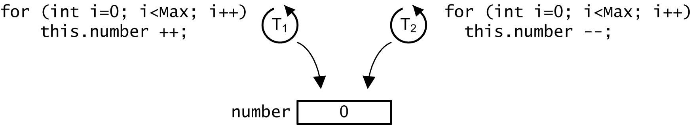
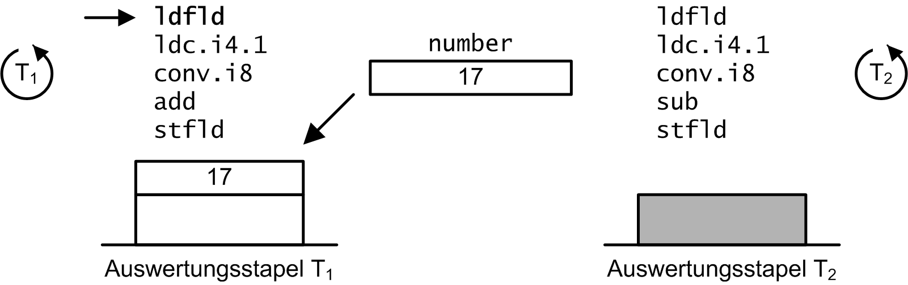
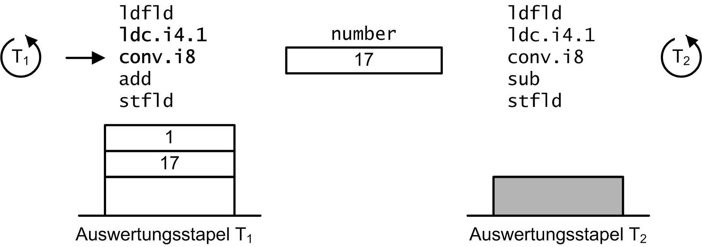
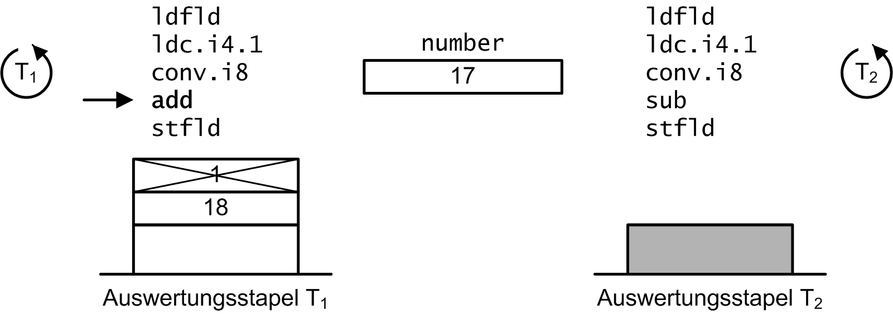
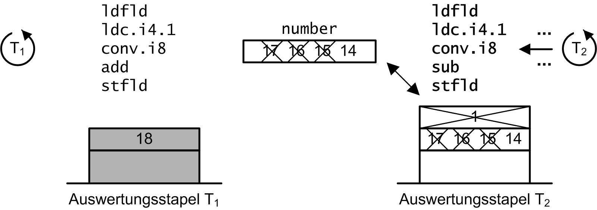
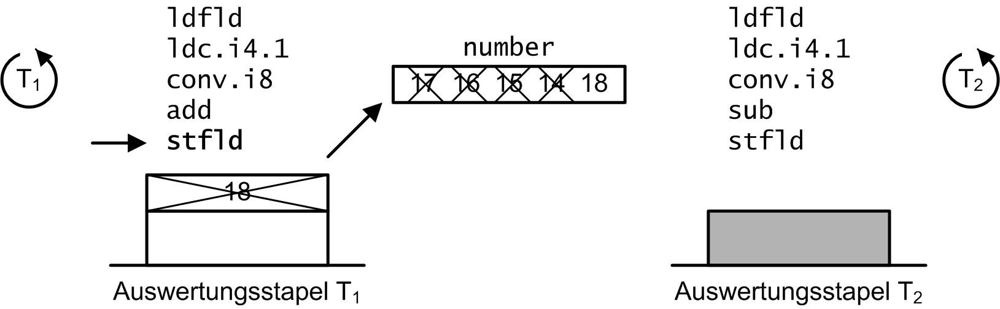
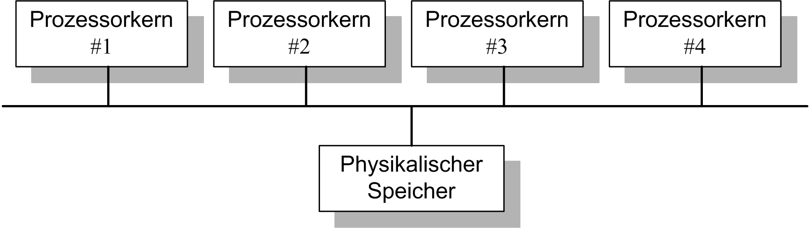

# Atomare Operationen

---

[Zurück](../../Readme.md)

---

| Muster | Kurzbeschreibung |
|:-------------- |----|
| [(Simple) Factory](../Patterns/Factory/Resources/Readme.md) | Ein **Simple Factory** Objekt wird typischerweise vom Client über eine statische Methode aufgerufen und gibt eines von mehreren Objekten zurück, die alle dasselbe übergeordnete Objekt erben bzw. im Falle einer Schnittstelle implementieren. |
| [Factory Method](../Patterns/FactoryMethod/Resources/Readme.md) | Das **Factory Method** Entwurfsmuster dient der Entkopplung des Clients von der konkreten Instanziierung einer Klasse. Die Klasse des erstellten Objekts kann elegant ausgetauscht werden. |
| [Abstract Factory](../Patterns/AbstractFactory/Resources/Readme.md) | Das **Abstract Factory** Design Pattern dient der Definition einer zusammenhängenden Familie aus Produkten. Die Familien können elegant ausgetauscht werden. |
| [Builder](../Patterns/Builder/Resources/Readme.md) | Ermöglicht schrittweises Erstellen komplexer Objekte. |
| [Prototype](../Patterns/Prototype/Resources/Readme.md) | Erstellen von Kopien vorhandener Objekte, ohne den Code von diesen Klassen abhängig zu machen. |
| [Singleton](../Patterns/Singleton/Resources/Readme.md) | Das **Singleton** Entwurfsmuster sorgt dafür, dass es von einer Klasse nur eine einzige Instanz gibt und diese global zugänglich ist. |

Tabelle 1. Erzeugungsmuster (*Creational Design Pattern*).


 

## Konkurrierender Zugriff auf Variablen

### Probleme des konkurrierenden Zugriffs auf eine Variable

Ein großer Vorteil von Threads liegt darin, dass sie Zugang zu allen Daten (Objekten) einer Anwendung haben.
Dass der nebenläufige Zugriff mehrerer Threads auf gemeinsame Variablen auch mit Problemen verbunden sein kann,
ist nicht unmittelbar einleuchtend. Wir betrachten zu diesem Zweck ein völlig harmlos erscheinendes Programm,
um zu einem tieferen Verständnis für derartige Stolperfallen zu gelangen.
Zwei Threads greifen in dieser Fallstudie nebenläufig auf eine ``long``-Variable zu, die vor dem Start der Threads
in einem definierten Anfangszustand vorliegt, also beispielsweise den Wert 0 hat.
Ein Thread ist dafür verantwortlich, diese Variable in einer Wiederholungsschleife
kontinuierlich um den Wert 1 zu vergrößern, der andere hingegen verkleinert die Variable um 1 (*Abbildung 1*).
      


*Abbildung* 1: Zwei Threads inkrementieren bzw. dekrementieren nebenläufig dieselbe Variable ``number``.

Wenn beide Wiederholungsschleifen dieselbe Anzahl Schleifendurchläufe ausführen, sollte man erwarten,
dass der Wert der Variablen nach
Beendigung der zwei Threads mit dem ursprünglichen Wert übereinstimmt, oder? 
Um uns von der Richtigkeit dieser Annahme zu überzeugen,
untermauern wir diese Fragestellung mit einem verifizierenden Programm
(**Listing 1**):
      
```cpp
01: class Number
02: {
03:     private const int MaxIteration = 100;
04:     private long number;
05: 
06:     public Number()
07:     {
08:         this.number = 0;
09:     }
10: 
11:     public void IncrementDecrement()
12:     {
13:         Parallel.Invoke
14:         (
15:             () =>
16:             {
17:                 for (int i = 0; i < MaxIteration; i++)
18:                     this.number++;
19:             },
20:             () =>
21:             {
22:                 for (int i = 0; i < MaxIteration; i++)
23:                     this.number--;
24:             }
25:         );
26:     }
27: 
28:     public override String ToString()
29:     {
30:         return String.Format("Value = {0}", this.number);
31:     }
32: }
33: 
34: class Program
35: {
36:     public static void Main ()
37:     {
38:         Number number = new Number();
39:         Console.WriteLine(number);
40: 
41:         Stopwatch watch = new Stopwatch();
42:         watch.Start();
43:         number.IncrementDecrement();
44:         watch.Stop();
45: 
46:         Console.WriteLine(number);
47:         Console.WriteLine("[{0} msecs]", watch.ElapsedMilliseconds);
48:     }
49: }
```

##### Listing 1: Zugriff zweier Aktionen auf eine gemeinsame Instanzvariable.

Eine wiederholte Ausführung dieses Programms produziert stets die Ausgabe
        
```
Value = 0
Value = 0
[79 msecs]
```
     
also genau das Ergebnis, das wir eigentlich erwarten. Zumindest können wir diese Bebachtung bei vergleichsweise kleinen Endwerten bei der ``for``-Wiederholungsschleife machen.
Wir treffen auf eine Überraschung, wenn wir den Endwert
der Wiederholungsschleife um ein Vielfaches höher setzen, beispielsweise auf den Wert 1000000000
(der Wertebereich des Datentyps ``int`` wird
mit diesem Wert noch nicht überschritten). 
Weitere Ausführungen des Programms ziehen plötzlich unerwartete Ergebnisse nach sich, etwa der Gestalt:
        
```
Value = 0
Value = -2949
[80 msecs]
```
  
Oder auch:
      
```
Value = 0
Value = -20107
[79 msecs]
```

Wie sind diese - dazu noch unterschiedlichen - Resultate der Programmausführung zu erklären?
Zur Beantwortung dieser Frage werfen wir zunächst in **Listing 2**
einen Blick auf den vom Compiler erzeugten Zwischencode der ``IncrementDecrement``-Methode:
      
```cpp
01: .method public hidebysig instance void  IncrementDecrement() cil managed
02: {
03:   // Code size       46 (0x2e)
04:   .maxstack  5
05:   .locals init ([0] class [mscorlib]System.Action[] CS$0$0000)
06:   IL_0000:  nop
07:   IL_0001:  ldc.i4.2
08:   IL_0002:  newarr     [mscorlib]System.Action
09:   IL_0007:  stloc.0
10:   IL_0008:  ldloc.0
11:   IL_0009:  ldc.i4.0
12:   IL_000a:  ldarg.0
13:   IL_000b:  ldftn      instance void Number::'<IncrementDecrement>b__0'()
14:   IL_0011:  newobj     instance void [mscorlib]
15:                            System.Action::.ctor(object, native int)
16:   IL_0016:  stelem.ref
17:   IL_0017:  ldloc.0
18:   IL_0018:  ldc.i4.1
19:   IL_0019:  ldarg.0
20:   IL_001a:  ldftn      instance void Number::'<IncrementDecrement>b__1'()
21:   IL_0020:  newobj     instance void [mscorlib]
22:                            System.Action::.ctor(object, native int)
23:   IL_0025:  stelem.ref
24:   IL_0026:  ldloc.0
25:   IL_0027:  call       void [mscorlib]
26:                            System.Threading.Tasks.Parallel::
27:                            Invoke(class [mscorlib]System.Action[])
28:   IL_002c:  nop
29:   IL_002d:  ret
30: } // end of method Number::IncrementDecrement
```

##### Listing 2: MSIL-Opcode der ``IncrementDecrement``-Methode aus der Klasse ``Number``.

Noch sind wir nicht am Ziel angekommen. In den Zeilen 13 und 20 von
**Listing 2** erkennen wir, 
dass mit dem MSIL-Opcode ``ldftn`` ("*load function*") Methodenadressen (Indizes)
auf dem Auswertungsstapel abgelegt werden.

Für jede Aktion, die wir an die ``Parallel.Invoke``-Methode mit einem Lambda-Ausdruck übergeben,
generiert der Compiler intern eine Methode in der ``Number``-Klasse.

Die beiden Methoden ``<IncrementDecrement>b__0`` und ``<IncrementDecrement>b__1``
können wir in dem Assembly sehr wohl aufspüren.

Von der ``<IncrementDecrement>b__0``-Methode,
die offensichtlich dem ersten Lambda-Ausdruck entspricht und sich damit um das Inkrementieren der ``number``-Variablen kümmert,
sieht der MSIL-Opcode so aus (**Listing 3**):
      

```cpp
01: .method private hidebysig instance void  '<IncrementDecrement>b__0'() cil managed
02: {
03:   // Code size       37 (0x25)
04:   .maxstack  3
05:   .locals init ([0] int32 i, [1] bool CS$4$0000)
06:   IL_0000:  nop
07:   IL_0001:  ldc.i4.0
08:   IL_0002:  stloc.0
09:   IL_0003:  br.s       IL_0018
10:   IL_0005:  ldarg.0
11:   IL_0006:  dup
12:   IL_0007:  ldfld      int64 Number::number
13:   IL_000c:  ldc.i4.1
14:   IL_000d:  conv.i8
15:   IL_000e:  add
16:   IL_000f:  stfld      int64 Number::number
17:   IL_0014:  ldloc.0
18:   IL_0015:  ldc.i4.1
19:   IL_0016:  add
20:   IL_0017:  stloc.0
21:   IL_0018:  ldloc.0
22:   IL_0019:  ldc.i4     0x186a0
23:   IL_001e:  clt
24:   IL_0020:  stloc.1
25:   IL_0021:  ldloc.1
26:   IL_0022:  brtrue.s   IL_0005
27:   IL_0024:  ret
28: } // end of method Number::'<IncrementDecrement>b__0'
```

##### Listing 3: MSIL-Opcode der ``<IncrementDecrement>b__0``-Methode aus der Klasse ``Number``.

Die erste Beobachtung können wir mit einem kurzen Blick auf **Listing 3** treffen.
Der Inkrement-Operator ``++`` aus C# wird nicht 1:1 auf einen IL-Opcode abgebildet, sondern auf mehrere.
Bei etwas genauerem Hinsehen kann man leicht die fünf IL-Anweisungen in **Listing 3**
ausmachen, die in C# für die Anweisung
      
```
this.number++;
```
      
generiert werden. Es handelt sich um die Zeilen 12 bis 16:
      
 
```
IL_0007:  ldfld      int64 Number::number
IL_000c:  ldc.i4.1
IL_000d:  conv.i8
IL_000e:  add
IL_000f:  stfld      int64 Number::number
```
      
Wenngleich die Semantik der einzelnen Opcodes für unser Problem nicht relevant ist, führen wir dennoch eine kurze
Beschreibung dieser Befehle auf, um diese Codesequenz nicht allzu abstrakt im Raum stehen zu lassen.
``ldfld`` ("*load field*") platziert den Wert einer Instanzvariablen auf dem Auswertungsstapel,
``stfld`` ("*store field*") ersetzt im Gegensatz dazu den Wert einer Instanzvariablen mit dem obersten Wert des Auswertungsstapels.
Der Opcode ``ldc.i4``  ("*load constant*") legt die im Operanden spezifizierte Konstante
im Format ``System.Int32`` auf den Stapel.
Da in unserem Beispiel das Ergebnis der noch folgenden Addition eine ``long``-Variable ist,
also intern vom Format ``System.Int64`` ist,
ergänzt der Compiler den Opcode ``conv.i8`` ("*convert top of stack to an 8 byte integer*"):
Diese Typkonvertierungsroutine wandelt den obersten Wert des Auswertungsstapels
in eine 64-Bit Integerzahl um (Format ``System.Int64``),
und legt das Resultat wieder auf dem Stapel ab.
Schließlich addiert der ``add``-Opcode die beiden obersten Werte des Auswertungsstapels
und legt das Ergebnis wiederum dort ab.
      
Haben Sie bereits eine Vorahnung, worin unser Problem liegen könnte,
wenn sich zwei bzw. mehrere Threads in unterschiedlichen Code-Abschnitten tummeln,
die auf dieselbe Variable lesend und schreibend zugreifen?
Ich helfe Ihnen zur Veranschaulichung des Sachverhalts mit einer kleinen Bilderserie,
die in Zeile 18 von
**Listing 3**
einen Threadwechsel zu Grunde legt (also zwischen dem ``add``-und dem ``stfld``-Opcode).
Wir steigen in unsere Sequenz mit den Annahmen ein, dass Thread T<subscript>1</subscript> augenblicklich aktiv ist und
in ``number``
der Wert 17 abgelegt ist.
*Abbildung* XXX achtet ferner darauf, dass jedem Thread sein eigener Auswertungsstapel zugeordnet ist.
Noch zur Vollständigkeit halber:
Der konkurrierende Thread T<subscript>2</subscript> bearbeitet in der ``Decrement``-Methode die Opcode-Sequenz:

      
```
IL_0007:  ldfld      int64 Number::number
IL_000c:  ldc.i4.1
IL_000d:  conv.i8
IL_000e:  sub
IL_000f:  stfld      int64 Number::number
```   

Nun zu *Abbildung* 2,
die Ausführung des ``ldfld``-Opcodes legt hier gerade
den aktuellen Wert von ``number`` auf dem T<subscript>1</subscript>-spezifischen Auswertungsstapel ab:
      



*Abbildung* 2: Ausführung des ``ldfld``-Opcodes im Kontext von Thread T<subscript>1</subscript>.

Es schließen sich die zwei Opcodes ``ldc`` und ``conv`` an, danach sieht der Auswertungsstapel wie
in *Abbildung* 3 gezeigt aus:
      



*Abbildung* 3: Ausführung der ``ldc``- und ``conv``-Opcodes im Kontext von Thread T<subscript>1</subscript>.


Wir nehmen nun an, dass mit ``add`` der letzte Opcode im Kontext von T<subscript>1</subscript> ausgeführt wird,
danach verlassen wir T<subscript>1</subscript> mit folgender Situation
(*Abbildung* 4):
      


*Abbildung* 4: Ausführung des ``add``-Opcodes im Kontext von Thread T<subscript>1</subscript>.

Für Thread T<subscript>2</subscript> unterstellen wir der Einfachheit halber, dass dieser "nur" drei Mal den betrachten Codeabschnitt
der ``Decrement``-Methode durchläuft.
Insbesondere müssen wir für diesen Thread keinen Threadwechsel innerhalb des betrachteten Abschnitts zu Grunde legen.
Nach drei Durchläufen haben wir im Laufzeitsystem folgendes Bild vorliegen:



*Abbildung* 5: Dreimaliges Dekrementieren der Variablen ``number``.
   
Nach dreimaligem Dekrementieren (im Kontext von Thread T<subscript>2</subscript>) besitzt
die Variable ``number`` den Wert 14.
Nun kommen wir in die entscheidende Phase unserer Fallstudie:
Thread T<subscript>1</subscript> erlangt wieder die Zuteilung der Programmausführung.
Es erfolgt ein Umschalten auf den Auswertungsstapel von T<subscript>1</subscript>, der nächste auszuführende Opcode ist ``stfld``,
die Situation nach der Ausführung dieses Befehls ist in
*Abbildung* 6 dargestellt:
      



*Abbildung* 6: Erneute Zuteilung der Programmausführung an Thread T<subscript>1</subscript>.
    
Die erneute Zuteilung der Programmausführung an Thread T<subscript>1</subscript>
zieht einen unerwünschten Effekt nach sich:
Die Variable ``number`` wird mit dem Wert 18 überschrieben.
*Abbildung* 6 bringt das Problem ans Tageslicht: Das Wiederaufsetzen von Thread T<subscript>1</subscript>
hat zur Folge, dass zunächst der Auswertungsstapel in den Zustand gebracht wurde,
wie ihn T<subscript>1</subscript> beim Threadwechsel hinterlassen hat.
Insbesondere bedeutet dies, dass nach dem Austauschen des Auswertungsstapels der fast schon in Vergessenheit geratene Wert 18
auf dem Stapel zum Vorschein kommt und bei der folgenden ``stfld``-Anweisung in die Variable
``number`` geschrieben wird.
Die Folge ist, dass die drei ausgeführten Dekrement-Anweisungen von Thread T<subscript>2</subscript>
unter den Tisch fallen, was natürlich im Widerspruch zur erwarteten Ausführung des Programms steht -
in unserer Fallstudie gerät
die Balance zwischen den inkrementierenden und dekrementierenden Anweisungen aus dem Gleichgewicht,
die ``number``-Variable nimmt falsche Werte an.
      
### Atomare Operationen

Das zuvor beschriebene Problem lässt sich etwas kürzer und prägnanter so formulieren:
Ein Threadwechsel innerhalb der betrachten Opcode-Sequenzen hat zur Folge,
dass der lesende und schreibende Zugriff auf eine Variable nicht zusammenhängend ausgeführt werden.
Verbunden mit dem Umstand, dass jeder Thread einen eigenen Auswertungsstapel unterhält,
können beim Eintreten von Threadwechseln in diesen Abschnitten inkorrekte Daten entstehen.
Im Fachjargon spricht man davon, dass - wenn wir uns wieder eine Ebene höher in die
Sichtweise von C# begeben - der C#-Operator ``++`` nicht *atomar*
ausgeführt wird. Nebenbei bemerkt: Wir haben es an dieser Stelle nicht mit einem singulären C# oder .NET-Problem zu tun,
auf nahezu jedem Rechner wird das Inkrementieren oder Dekrementieren einer Variablen in drei Schritten
ausgeführt:
      
  * Lade den Wert einer Variablen in ein Register bzw. lege ihn auf dem threadspezifischen Stapel ab. 
  * Inkrementiere (oder dekrementiere) das Register bzw. die oberste Zelle des Stapels.
  * Transferiere den Inhalt des Registers (oder des obersten Stapelelements) zurück in die Variable.

Tritt in dieser Schrittfolge ein Threadwechsel nach dem ersten oder zweiten Schritt ein,
führt das Umschalten des Auswertungsstapels bzw. das threadspezifische Retten und Restaurieren
aller Register zu dem zuvor beschriebenen Problem.
Um es noch einmal zu betonen: Das Problem der atomaren Ausführung von Variablenzugriffen entsteht
nur im Umfeld von konkurrierenden Zugriffen mehrerer Threads auf diese Variable - in der schönen Welt eines
Singlethreaded-Programms begegnen wir derartigen Stolperfallen nicht!

Mit regulären Mitteln der Programmiersprache C# können wir die Atomarität eines C#-Operators nicht erzwingen.
Wir benötigen dazu spezielle Methoden aus der .NET-Klassenbibliothek und werden in der Klasse
``Interlocked`` fündig
(**Tabelle** 1):


| Methode | Beschreibung |
|:-------------- |----|
| Methode ``Increment`` | ```public static int Increment (ref int location);```<br/>Inkrementiert den Wert der spezifizierten Variablen im Zuge einer atomaren Operation. |
| Methode ``Decrement`` | ```public static int Decrement (ref int location);```<br/>Dekrementiert den Wert der spezifizierten Variablen im Zuge einer atomaren Operation. |
| Methode ``Exchange`` | ```public static int Exchange (ref int location, int value);```<br/>Setzt den Wert der spezifizierten Variablen im Zuge einer atomaren Operation (atomare, unbedingte Wertzuweisung). |
| Methode ``CompareExchange`` | ```public static int CompareExchange (ref int location, int value, int comparand);```<br/>Setzt den Wert der spezifizierten Variablen in Abhängigkeit vom Resultat eines Vergleichs im Zuge einer atomaren Operation (atomare, bedingte Wertzuweisung). |
| XXX | YYY |
| XXX | YYY |
| XXX | YYY |
| XXX | YYY |

Tabelle 1. Definition der Klasse ``System.Threading.Interlocked``.
       
Mit Hilfe der beiden atomaren Methoden ``Increment`` und ``Decrement``
aus der Klasse ``Interlocked`` modifizieren wir die Klasse ``Number`` wie folgt:
      

```cpp
01: public void IncrementDecrement()
02: {
03:     Parallel.Invoke
04:     (
05:         () =>
06:         {
07:             for (int i = 0; i < Number.MaxIteration; i++)
08:                 Interlocked.Increment(ref this.number);
09:         },
10:         () =>
11:         {
12:             for (int i = 0; i < Number.MaxIteration; i++)
13:                 Interlocked.Decrement(ref this.number);
14:         }
15:     );
16: }
```

##### Listing 4: Atomarer Zugriff zweier Aktionen auf eine gemeinsame Instanzvariable.

Die einzigen Änderungen in **Listing 4** im Vergleich zu **Listing 1**
finden wir in den Zeilen 8 und 13 vor: Die nicht-atomaren C#-Operatoren ``++`` bzw. ``--`` wurden durch zwei entsprechende atomare Methoden
aus der ``Interlocked``-Klasse ersetzt. Eine erneute Ausführung des Programms produziert
nun - auch bei sehr vielen Schleifendurchläufen - das erwartete, korrekte Ergebnis:
      
```
Value = 0
Value = 0
[647 msecs]
```
      
Fällt Ihnen dennoch ein Unterschied zu den Beispielen am Anfang dieser Betrachtungen auf? Richtig gesehen,
die Ausführungszeit des Programms ist signifikant in die Höhe gegangen, in etwa um den Faktor 5 bis 10.
Dieser Umstand soll - bzw. genauer formuliert: kann - Sie nicht davon abhalten, den Zugriff
auf gemeinsame Daten in einer Multithreadingumgebung atomar zu gestalten.
Nur sollte man wissen, dass die auf diese Weise
erzielte Integrität der Daten auch ihren Preis hat. Gibt es Fälle, in denen Sie die Daten sequentiell bearbeiten könnten,
ohne dass die Architektur oder Bedienerfreundlichkeit Ihrer Anwendung darunter leidet,
sollte man auf den Komfort
des Multithreadings verzichten, da Einbußen bei der Laufzeit entstehen können.
Natürlich gibt es hier keine "ideale" Empfehlung,
da eine Sequentialisierung von Codeabschnitten auch zu einer Verschlechterung der Laufzeit führt.
Die Moral dieser Überlegungen ist einfach, dass der Zugriff auf gemeinsame Daten zum einen zu schützen ist,
zum anderen mit Bedacht einzusetzen ist,
da die Ausführung des Programms mit Sicherheit nicht schneller wird.
      
*Abschließender Hinweis*:

Interessieren Sie sich vielleicht für die interne Funktionsweise der Methoden aus der ``Interlocked``-Klasse?

Detaillierte Informationen hierzu finden sich im Teilgebiet "Rechnerarchitekturen" der Informatik,
die Stichwörter und Grundlagen des konkurrierenden Speicherzugriffs können wir deshalb nur kurz anreißen.

Jeder Prozess des Windows-Betriebssystems besitzt zu Beginn einen Thread und kann danach
(mit entsprechenden Funktionen des Betriebssystems oder in einer .NET-Anwendung verdeckt durch entsprechende Klassen
 aus den Namensräumen ``System.Threading`` oder ``System.Threading.Tasks``)
weitere Threads erzeugen.

Zentral für alle Threads eines Prozesses ist - unabhängig davon, wie sie erzeugt wurden -,
dass sie alle auf einen gemeinsamen virtuellen Adressraum zugreifen.

Virtuelle Adressen dienen dem Zweck, einem Prozess einen größeren Hauptspeicherumfang vorzutäuschen,
als dieser in Wirklichkeit besitzt.

Wenn nicht genügend physikalischer Hauptspeicher zur Verfügung steht,
können - unter einem Betriebssystem, dass eine virtuelle Speicherverwaltung unterstützt - einzelne *Kacheln* auf die Festplatte ausgelagert werden.

Unter einer *Kachel* versteht man dabei eine Aufteilung des virtuellen Adressraums in gleich große Abschnitte (so genannte "Pages"),
die sich zum Hin- und Herkopieren zwischen virtuellem und physikalischem Speicherbereich eignen,
was allerdings zu erheblichen Zeitverzögerungen bei einem nachfolgenden Zugriff führt.
        


*Abbildung* 7: Mehrkern-Systeme mit gemeinsamen Speicherbereich.

Speicher kann für eine CPU direkt im Prozessor integriert (so genannter *CPU-Cache*)
oder extern auf der Hauptplatine platziert sein.

Grundsätzlich ist der Zugriff auf Cache-Speicherbereiche direkt auf einer CPU deutlich schneller.
Aus Gründen wie zum Beispiel technische Komplexität oder aber auch Produktions- und Entwicklungskosten
lässt sich der Speicher auf einem CPU-Chip aber nicht beliebig ausbauen.

Nach diesen einleitenden Vorbereitungen kommen wir nun auf die Multikernprozessorsysteme zu sprechen.

Sämtliche Ressourcen wie eine arithmetisch-logische Einheit (ALU), die Registersätze usw. sind hier mehrfach vorhanden,
insbesondere eben auch die Cache-Speicherbereiche.

Der Cache-Speicher ist eine Kopie eines bestimmten Bereichs aus dem Hauptspeicher.

Wie bei der Abbildung von virtuellen und physikalischen Adressen eines Prozesses wird auch der Hauptspeicher
in gleichgroße Blöcke eingeteilt, die man jetzt *Cache-Lines* nennt.

Cache-Lines können unabhängig voneinander gefüllt werden und entsprechen einem Abschnitt des Hauptspeichers.

Im Cache-Speicher eines jeden Prozessorkerns befindet sich immer eine bestimmte Anzahl von Cache-Lines.

Sie sind dazu da, möglichst schnell auf bestimmte Daten zugreifen zu können. 

        

        
Hierbei kann nun das Problem der so genannten *Cache-Kohärenz* entstehen.

Unter Cache-Kohärenz versteht man den Zustand, wenn sich in einem Cache-Speicher andere Daten befinden,
als im zugehörigen Bereich des Hauptspeichers. 

Diese Situation kann entstehen, wenn mehrere Kerne dieselbe Cache-Line vom Hauptspeicher einlesen und sie dann jeweils verändern!

In diesem Fall gehen konkurrierende Prozessorkerne von unterschiedlichen Werten im Hauptspeicher aus,
so wie wir dies am Beispiel des parallelen Inkrementierens und Dekrementierens einer Variablen nachweisen konnten.
        
Die Methoden aus der ``Interlocked``-Klasse unternehmen nicht gerade aufwandsarme Anstrengungen,
um derartige Inkonsistenzen in der Sichtweise mehrerer Prozessorkerne auf den Hauptspeicher zu beseitigen.

Eine Lösungsmöglichkeit besteht darin, alle Prozessorkerne mit einer
sogenannten *Schnüffel*-Logik (*Snooping*-Bus) auszustatten.

Die Schnüffel-Logik stellt fest, ob ein bestimmter Cache-Eintrag durch einen anderen Prozessor verändert wurde.

Die Logik erklärt dann den Cache-Eintrag für ungültig und löst folglich das Nachladen des Cache-Eintrags aus.

Das MESI-Protokoll (*Modified Shared Exclusive Invalid*) ist ein weiteres Kohärenzprotokoll,
um sicherzustellen, dass Schreibzugriffe eines Prozessors irgendwann für alle anderen Prozessoren sichtbar werden
und dass nie zwei Prozessoren gleichzeitig auf dieselbe Speicherstelle schreiben.
        
Dieser kleine Exkurs in die Architektur von Rechnern dürfte es für Sie verständlicher gemacht haben,
worin sich der doch erhebliche Zeitunterschied in nicht-synchronisierter (fehlerhafter) Software einerseits
sowie der Benutzung Cache-kohärenter ``Interlocked``-Klassemethoden auf der anderen Seite erklären lässt.

---

[Zurück](../../Readme.md)

---
