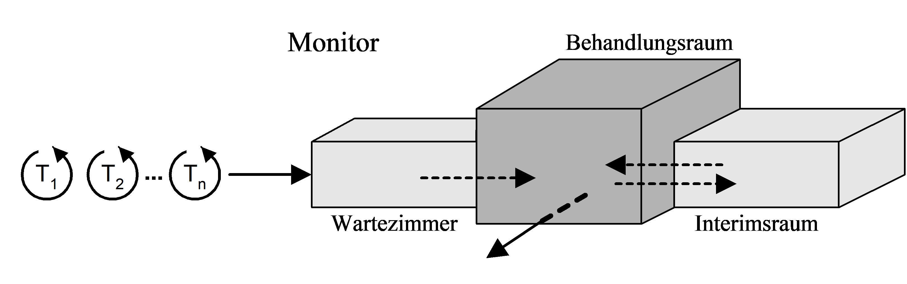
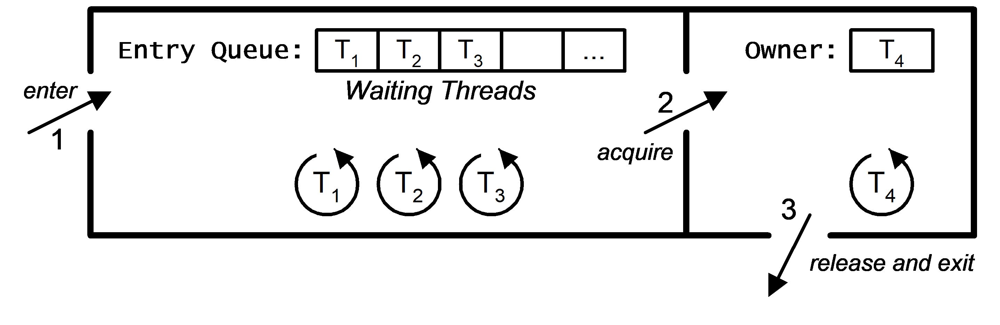
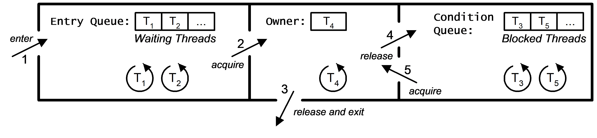

# Mutexe und Sperrmechanismen

[Zurück](../../Readme.md)

---

## Inhalt

  * [Verwendete Werkzeuge](#link1)
  * [Allgemeines](#link2)
  * [Der gegenseitige Ausschluss (engl. *Mutual Exclusion*)](#link3)
  * [Das Monitor-Konzept von Edsger W. Djikstra](#link4)
  * [Mutex-Klassen](#link5)
  * [Hüllen-Klassen für Mutexobjekte](#link6)
  * [Sperrstrategien (*Locking Strategies*)](#link7)
  * [Weitere Beispiele](#link8)
  * [Literaturhinweise](#link9)

---

## Verwendete Werkzeuge <a name="link1"></a>

<ins>Mutex-Klassen</ins>:

  * Klasse `std::mutex`
  * Klasse `std::recursive_mutex`
  * Klasse `std::shared_mutex`
 
<ins>Hüllen-Klassen für Mutexobjekte</ins>:

  * Klasse `std::lock_guard`
  * Klasse `std::unique_lock`
  * Klasse `std::scoped_lock`
  * Klasse `std::shared_lock`

<ins>Sperrstrategien (*Locking Strategies*)</ins>:

  * Klasse `std::defer_lock`
  * Klasse `std::std::adopt_lock`

---

#### Quellcode

  * Elementare Demonstration des `std::mutex` Objekts:<br />
    Die parallele Ausgabe mit `std::cout` kann mit und ohne *Mutex*-Sperre beobachtet werden.<br />
    [*Mutex_01_Simple.cpp*](Mutex_01_Simple.cpp).

  * Fortgeschrittene Demonstration des `std::mutex` Objekts mit Hüllenklassen:<br />
    [*Mutex_02_Advanced.cpp*](Mutex_02_Advanced.cpp).

  * Fortgeschrittene Beispiele:<br />
    Die Sperrmechanismen `std::adopt_lock` und `std::defer_lock`.<br />
    Die Klasse `std::recursive_mutex`: Geschachteltes Sperren.<br />
    Die Klasse `std::scoped_lock`: Mehrfaches Sperren.<br />
    [*Example_LockingStrategies.cpp*](Example_LockingStrategies.cpp).<br />
    [*Example_RecursiveMutex.cpp*](Example_RecursiveMutex.cpp).<br />
    [*Example_ScopedLock.cpp*](Example_ScopedLock.cpp).

---

## Allgemeines <a name="link2"></a>

*Concurrency* (Nebenläufigkeit, Parallelität) und *Synchronization* (Synchronisation)
sind entscheidende Aspekte der Multithreading-Programmierung.

In C++ stellt die Standardbibliothek mehrere Synchronisierungsprimitive bereit,
wie etwa `std::mutex`, `std::lock_guard`, `std::unique_lock` usw.,
die dazu beitragen, Thread-Sicherheit zu gewährleisten und *Data Races* zu verhindern,
wenn mehrere Threads auf gemeinsam genutzte Ressourcen gleichzeitig zugreifen.

---

## Der gegenseitige Ausschluss (engl. *Mutual Exclusion*) <a name="link3"></a>

Aus *Wikipedia*:

"Der Begriff "**gegenseitiger Ausschluss**" bzw. *Mutex* (Abk. für engl. *Mutual Exclusion*) bezeichnet eine Gruppe von Verfahren,
mit denen das Problem des kritischen Abschnitts gelöst wird.
Mutex-Verfahren verhindern, dass nebenläufige Prozesse bzw. Threads gleichzeitig oder zeitlich verschränkt
gemeinsam genutzte Datenstrukturen unkoordiniert verändern, wodurch die Datenstrukturen in einen inkonsistenten Zustand geraten können,
auch wenn die Aktionen jedes einzelnen Prozesses oder Threads für sich betrachtet konsistenzerhaltend sind.

Mutex-Verfahren koordinieren den zeitlichen Ablauf nebenläufiger Prozesse/Threads derart,
dass andere Prozesse/Threads von der Ausführung kritischer Abschnitte ausgeschlossen sind,
wenn sich bereits ein Prozess/Thread im kritischen Abschnitt befindet (die Datenstruktur verändert)."

---

## Das Monitor-Konzept von Edsger W. Djikstra <a name="link4"></a>


*Abbildung* 1: Edsger W. Dijkstra, 2002.



*Abbildung* 2: Anschauliche Darstellung eines Monitors: Ein Gebäude mit drei Räumen, in dem sich beliebig viele Threads nach bestimmten Spielregeln bewegen dürfen..



*Abbildung* 3: Erste Veranschaulichung eines Monitors: Aspekt des gegenseitigen Ausschlusses.



*Abbildung* 4: Zweite, vollständige Veranschaulichung eines Monitors: Aspekt der Koordination von Threads.

---

## Mutex-Klassen <a name="link5"></a>

Folgende Mutex-Klassen werden hierzu von der C++&ndash;Standardbibliothek bereitgestellt:

### Klasse `std::mutex`

Die Klasse `std::mutex` steht für *sperrbare Objekte*. Darunter versteht man Objekte, die zwei
Methoden `lock` und `unlock` besitzen, die verhindern, dass kritische Codeabschnitte von anderen Threads
zum selben Zeitpunkt durchlaufen werden können und auf dieselben Speicherorte zum selben Zeitpunkt
zugegriffen werden kann.

  * Mit einem `std::mutex`-Objekt kann man *Race Conditions* zwischen mehreren Threads verhindern,
    indem man den Zugriff auf eine gemeinsam genutzte Ressource explizit sperrt (`lock`) und entsperrt (`unlock`).
  * *Nachteil*: Kommt es &ndash; aus welchen Gründen auch immer &ndash; nicht zum Aufruf von `unlock` nach einem `lock`-Aufruf,
    gerät die Programmausführung in den Zustand &bdquo;UB&rdquo; (*Undefined Behaviour*).


### Klasse `std::recursive_mutex`

Die `std::recursive_mutex`-Klasse ist eine Variante der `std::mutex`-Klasse,
die es einem Thread ermöglicht, mehrere Sperren zu halten.
Erst wenn alle Sperren aufgehoben sind, können andere Threads dieses Mutexobjekt erwerben.

Ein Anwendungsfall für die `std::recursive_mutex`-Klasse wird in dem Entwurfsmuster
[Strategisches Locking (Strategized Locking)](../../Programs/22_StrategizedLocking/Readme.md)
aufgezeigt.

Der Einsatz der Klasse `std::recursive_mutex` ist dann erforderlich, wenn Sie zum einen
threadsichere Datenstrukturen entwerfen und zum anderen die Methoden der
öffentlichen Schnittstelle von unterschiedlichen Ebenen aus aufrufen,
um auf die kritischen Abschnitte bzw. Daten der Datenstruktur zuzugreifen.

### Klasse `std::shared_mutex`

In C++ kann man mit den beiden Klassen `std::shared_mutex` und `std::shared_lock` ein Synchronisationsprimitiv umsetzen,
das es mehreren Threads ermöglicht, eine gemeinsam genutzte Ressource gleichzeitig zum Lesen zu nutzen
und gleichzeitig exklusiven Schreibzugriff zu gewährleisten.
Weitere Informationen siehe [hier](#klasse-stdshared_lock).

---

## Hüllen-Klassen für Mutexobjekte <a name="link6"></a>

### Klasse `std::lock_guard`

Leichtgewichtige Realisierung (*lightweight implementation*) eines einfachen Sperrmechanismus.
Bietet exklusiven Besitz eines `std::mutex`-Objekts für einen begrenzten Zeitraum (&bdquo;Scope&rdquo;, Block, Bereich).

  * Ein `std::lock_guard`-Objekt umschließt ein `std::mutex`-Objekt.
  * Bei der Erstellung eines `std::lock_guard`-Objekts wird das Mutexobjekt automatisch gesperrt.
  * Bei der Zerstörung (Verlassen des Gültigkeitsbereichs, *Scope*) wird das Mutexobjekt automatisch entsperrt.
  * Ein manuelles Entsperren oder erneutes Sperren des Mutexobjekts wird nicht unterstützt.
  * Ein `std::lock_guard`-Objekt kann ein bereits gesperrtes Mutexobjekt &bdquo;übernehmen&rdquo; (siehe in den nachfolgenden Beispielen Parameter `std::adopt_lock`).
  * Ideal für einfache, kurzzeitige Sperren, die eine automatische Freigabe beim Verlassen des Blocks gewährleisten.


### Klasse `std::unique_lock`

Die Klasse `std::unique_lock` bietet einen vielseitigen Sperrmechanismus
mit einer umfangreicheren Funktionalität als Klasse `std::lock_guard`.

  * Ein `std::unique_lock`-Objekt umschließt ein `std::mutex`-Objekt.
  * Im Gegensatz zu einem `std::lock_guard`-Objekt kann ein `std::unique_lock`-Objekt nach der Erstellung explizit gesperrt und entsperrt werden, es ermöglicht also sowohl manuelles Entsperren als auch erneutes Sperren.
  * Sie können immer ein `std::unique_lock`-Objekt anstelle eines `std::lock_guard`-Objekts verwenden, aber nicht umgekehrt.
  * Ein `std::unique_lock`-Objekt kann erzeugt werden, ohne dass zum Erzeugungszeitpunkt das Mutexobjekt gesperrt ist (siehe Gebrauch des Parameters `std::defer_lock`).
  * Es wird sowohl der exklusive Besitz (*exclusive ownership*) als auch der gemeinsame Besitz (*shared ownership*) eines Mutexobjekts unterstützt.
  * Unterstützt Verschiebe-Semantik.
  * Unterstützt zeitgesteuertes Sperren sowie Bedingungsvariablen (`std::condition_variable`).


### Klasse `std::scoped_lock`

Die Klasse `std::scoped_lock` realisiert einen sehr einfachen Mechanismus für sperrbare Objekte,
ähnlich zur Klasse `std::lock_guard`, aber mit dem Unterschied, dass `std::scoped_lock`
für mehrere Mutexobjekte gleichzeitig verwendet werden kann!

  * Ein `std::scoped_lock`-Objekt umschließt ein oder mehrere Mutexobjekte, genauso wie ein `std::lock_guard`-Objekt,
    aber mit der Ausnahme, dass ein `std::lock_guard`-Objekt jeweils nur **ein** Mutexobjekt umschließen kann!
  * Bei der Erstellung sperrt ein `std::scoped_lock`-Objekt automatisch ein oder mehrere Mutexobjekte.
  * Bei der Zerstörung (Verlassen des Gültigkeitsbereichs) entsperrt ein `std::scoped_lock`-Objekt automatisch alle Mutexobjekte.


### Klasse `std::shared_lock`

In C++ kann man mit den beiden Klassen `std::shared_mutex` und `std::shared_lock` ein Synchronisationsprimitiv umsetzen,
das es mehreren Threads ermöglicht, eine gemeinsam genutzte Ressource gleichzeitig zum Lesen zu nutzen
und gleichzeitig exklusiven Schreibzugriff zu gewährleisten.

Dies ist in Situationen hilfreich, in denen viele Threads schreibgeschützten Zugriff
auf dieselbe Datenstruktur benötigen, Schreibvorgänge jedoch nicht häufig auftreten.

  * Die Klasse `std::shared_lock` ist für den gemeinsamen Besitz (*shared ownership*) eines Mutexobjekts konzipiert und ermöglicht mehrere Leser.
  * Ermöglicht mehreren Threads den gleichzeitigen Erwerb der Sperre für den gemeinsamen lesenden Zugriff.
  * Gewährleistet Thread-Sicherheit, wenn mehrere Threads auf gemeinsam genutzte Ressourcen lesend zugreifen.
  * Ähnlich wie `std::lock_guard` wird kein manuelles Entsperren oder erneutes Sperren unterstützt.

Eine genauere Beschreibung der beiden Klassen `std::shared_mutex` und `std::shared_lock` wird in dem Entwurfsmuster
[Reader-Writer Lock](../../Programs/23_ReaderWriterLock/Readme.md)
aufgezeigt.

---

## Sperrstrategien (*Locking Strategies*) <a name="link7"></a>

In manchen Situationen muss ein Thread zwei Sperren gleichzeitig halten
und diese nach dem Zugriff auf die gemeinsam genutzten Daten freigeben.

Seit C++ 11 gibt es hierfür die Funktion `std::lock`:

<pre>
std::lock(lock<sub>1</sub>, lock<sub>2</sub>, ..., lock<sub>n</sub>);
</pre>

Sperrt die aufgeführten sperrbaren Objekte *lock*<sub>1</sub>, *lock*<sub>2</sub>, ..., *lock*<sub>n</sub>
mithilfe eines Algorithmus, der Deadlocks zu vermeiden versucht.

Wenn ein Thread mehr als eine Sperre hat, besteht die Gefahr eines Deadlocks.

Um dies zu vermeiden, gibt es mehrere Strategien in C++:


### Strategie `std::adopt_lock`

Die Strategie `std::adopt_lock` geht davon aus, dass der aufrufende Thread die Sperre bereits besitzt.
Ein Mutex-Hüllenobjekt sollte den Besitz des Mutex übernehmen und ihn freigeben,
wenn die Kontrolle den Gültigkeitsbereich verlässt.

```cpp
01: std::lock(g_mutex1, g_mutex2);
02: 
03: std::lock_guard<std::mutex> lock1{ g_mutex1, std::adopt_lock };
04: std::lock_guard<std::mutex> lock2{ g_mutex2, std::adopt_lock };
```

### Strategie `std::defer_lock`

Die Strategie `std::defer_lock` erwirbt *nicht* den Besitz des Mutex und geht davon aus,
dass der aufrufende Thread `lock` aufrufen wird,
um den Mutex zu erwerben.
Das Mutex-Hüllenobjekt gibt die Sperre frei, wenn die Kontrolle den Gültigkeitsbereich verlässt.

```cpp
01: std::unique_lock<std::mutex> lock1{ g_mutex1, std::defer_lock };
02: std::unique_lock<std::mutex> lock2{ g_mutex2, std::defer_lock };
03: 
04: std::lock(lock1, lock2);
```

### Unterschiede im Gebrauch von `std::lock_guard` und `std::unique_lock`

  * `std::lock_guard` mit der Strategie `std::adopt_lock` geht davon aus, dass der Mutex bereits erworben wurde.
  * `std::unique_lock` mit der `std::defer_lock`-Strategie geht davon aus, dass der Mutex nicht bei der Konstruktion erfasst wird, sondern explizit gesperrt wird.

---

## Weitere Beispiele <a name="link8"></a>

### Beispiel zur Klasse `std::scoped_lock`

Wir betrachten in diesem Beispiel ein Würfelspiel. Es sind 10 Spieler beteiligt.
Jeder Spieler würfelt gegen alle anderen Spieler, und dies erfolgt pro Spieler in einem separaten Thread.

Um das Aktualisieren der Punktezahlen akkurat durchzuführen, werden bei einem Würfelspiel zweier Spieler
die Datenbereiche *beider* Spieler gesperrt. 

Studieren Sie den Quellcode des Beispiels genau.

  * Wieviele Mutexobjekte werden in Methode `playWith` gesperrt?
  * Wann werden diese Mutexobjekte freigegeben?

```cpp
001: class Player
002: {
003: private:
004:     std::string_view                      m_name;
005:     std::mutex                            m_mutex;
006:     std::default_random_engine            m_random_engine;
007:     std::uniform_int_distribution<size_t> m_dist;
008:     size_t                                m_score;
009: 
010: public:
011:     // c'tor
012:     Player(std::string_view name, unsigned int seed)
013:         : m_name{ std::move(name) }, m_random_engine{ seed }, m_dist{1, 6 }, m_score{}
014:     {}
015: 
016:     // getter
017:     std::string_view name() const { return m_name; }
018: 
019:     size_t getScore() const { return m_score; }
020: 
021:     // public interface
022:     void incrementScore(size_t points) {
023: 
024:         m_score += points;
025:         Logger::log(std::cout, name(), " got ", points, " points => Score: ", m_score);
026:     }
027: 
028:     void playWith(Player& other) {
029: 
030:         if (&other == this) {
031:             return;
032:         }
033: 
034:         // retrieve our lock and the lock of the opponent
035:         std::scoped_lock lock{ m_mutex, other.m_mutex };
036: 
037:         Logger::log(std::cout, name(), " plays against ", other.name());
038: 
039:         // roll dice until one player wins, then increase the score of the winner
040:         size_t points{};
041:         size_t otherPoints{};
042: 
043:         while (points == otherPoints)
044:         {
045:             points = roll();
046:             otherPoints = other.roll();
047:         }
048: 
049:         if (points > otherPoints) {
050:             incrementScore(points);
051:         }
052:         else {
053:             other.incrementScore(otherPoints);
054:         }
055: 
056:         // locks are released automatically
057:     }
058: 
059: private:
060:     // roll a six-sided dice
061:     size_t roll() {
062:         return m_dist(m_random_engine);
063:     }
064: };
065: 
066: void example_scoped_lock()
067: {
068:     std::random_device device{};
069: 
070:     std::vector<std::unique_ptr<Player>> players{};
071: 
072:     std::initializer_list<std::string_view> names =
073:     {
074:         "Player1", "Player2", "Player3", "Player4", "Player5",
075:         "Player6", "Player7", "Player8", "Player9"
076:     };
077: 
078:     // generate players from the names using 'std::transform' algorithm
079:     std::transform(
080:         std::begin(names),
081:         std::end(names),
082:         std::back_inserter(players),
083:         [&] (std::string_view name) {
084:             return std::make_unique<Player>(name, device());
085:         }
086:     );
087: 
088:     std::println("Run the game: ");
089: 
090:     // each player plays against all other players in parallel
091:     std::vector<std::jthread> rounds;
092:     for (const auto& player : players) {
093:         
094:         auto round = [&] () {
095:             for (const auto& opponent : players) {
096:                 player->playWith(*opponent);
097:             }
098:         };
099:         
100:         rounds.push_back(std::jthread { std::move(round) });
101:     }
102: 
103:     // join all the threads
104:     std::for_each(
105:         rounds.begin(),
106:         rounds.end(),
107:         [](auto& t) { t.join(); }
108:     );
109: 
110:     std::println("Done.");
111: 
112:     // sort
113:     std::sort(
114:         players.begin(),
115:         players.end(),
116:         [] (const auto& elem1, const auto& elem2) {
117:             return elem1->getScore() > elem2->getScore();
118:         }
119:     );
120: 
121:     std::println("Final score:");
122:     for (const auto& player : players) {
123:         std::println("{}: {}  points.", player->name(), player->getScore());
124:     }
125: }
```

*Ausgabe*:

```
[1]:    Player1 plays against Player2
[1]:    Player2 got point => 3
[1]:    Player1 plays against Player3
[1]:    Player3 got point => 5
[1]:    Player1 plays against Player4
[1]:    Player1 got point => 5
[1]:    Player1 plays against Player5
[1]:    Player5 got point => 3
[1]:    Player1 plays against Player6
[1]:    Player6 got point => 2
[1]:    Player1 plays against Player7
[1]:    Player1 got point => 11
[1]:    Player1 plays against Player8
[1]:    Player1 got point => 16
[1]:    Player1 plays against Player9
[1]:    Player1 got point => 21
[2]:    Player5 plays against Player1
[2]:    Player5 got point => 6
[2]:    Player5 plays against Player2
[3]:    Player3 plays against Player1
[2]:    Player2 got point => 5
[3]:    Player3 got point => 8
[3]:    Player3 plays against Player2
[4]:    Player7 plays against Player1
[3]:    Player3 got point => 14
[4]:    Player7 got point => 5
......

[9]:    Player9 got point => 38
[7]:    Player9 plays against Player7
[7]:    Player9 got point => 42
[6]:    Player4 plays against Player8
[6]:    Player4 got point => 36
[6]:    Player4 plays against Player9
[6]:    Player9 got point => 47
[7]:    Player9 plays against Player8
[7]:    Player8 got point => 46

Final score:
Player3:        50 points.
Player9:        47 points.
Player8:        46 points.
Player1:        38 points.
Player4:        36 points.
Player6:        35 points.
Player7:        33 points.
Player5:        31 points.
Player2:        19 points.
```

### Beispiel zur Klasse `std::recursive_mutex`

Betrachten Sie das folgende Beispiel genau:

  * Welche Mutex-Klassen kommen zum Einsatz?
  * Studieren Sie die beiden Methoden `reserve` und `allocate`: Wann kommt es zum Gebrauch eines Mutex-Hüllenobjekts und wann nicht?
  * Begründen Sie Ihre Beobachtungen.


```cpp
001: constexpr size_t BucketSize = 4;
002: 
003: class NonRecursive
004: {
005: private:
006:     std::mutex                m_mutex;
007:     std::unique_ptr<size_t[]> m_data;
008:     size_t                    m_size;
009:     size_t                    m_capacity;
010: 
011: public:
012:     NonRecursive() : m_size{}, m_capacity{} {}
013: 
014:     void push_back(size_t value) {
015: 
016:         std::unique_lock lock{ m_mutex };
017: 
018:         // we already hold 'm_mutex', so we cannot call reserve()
019: 
020:         if (m_size == m_capacity) {
021:             allocate(m_capacity == 0 ? BucketSize : m_capacity * 2);
022:         }
023: 
024:         m_data[m_size++] = value;
025:     }
026: 
027:     void reserve(size_t capacity) {
028: 
029:         std::unique_lock lock{ m_mutex };
030: 
031:         allocate(capacity);
032:     }
033: 
034:     void print() {
035: 
036:         std::unique_lock lock{ m_mutex };
037: 
038:         for (size_t i{}; i != m_size; ++i) {
039:             std::cout << m_data[i] << ' ';
040:         }
041:         std::cout << std::endl;
042:     }
043: 
044: private:
045:     // allocate expects m_mutex to be held by the caller
046:     void allocate(size_t capacity) {
047: 
048:         std::cout << "allocating " << capacity << std::endl;
049: 
050:         std::unique_ptr<size_t[]> data{ std::make_unique<size_t[]>(capacity) };
051: 
052:         size_t newSize{ std::min(m_size, capacity) };
053: 
054:         std::copy(
055:             m_data.get(),
056:             m_data.get() + newSize,
057:             data.get()
058:         );
059: 
060:         m_data = std::move(data);
061:         m_capacity = capacity;
062:         m_size = newSize;
063:     }
064: };
065: 
066: class Recursive
067: {
068: private:
069:     std::recursive_mutex      recursive_mutex;
070:     std::unique_ptr<size_t[]> m_data;
071:     size_t                    m_size;
072:     size_t                    m_capacity;
073: 
074: public:
075:     Recursive() : m_size{}, m_capacity{} {}
076: 
077:     void push_back(size_t value) {
078: 
079:         std::unique_lock lock{ recursive_mutex };
080: 
081:         // holding a recursive mutex multiple times is fine
082: 
083:         if (m_size == m_capacity) {
084:             reserve(m_capacity == 0 ? BucketSize : m_capacity * 2);
085:         }
086: 
087:         m_data[m_size++] = value;
088:     }
089: 
090:     void reserve(size_t capacity) {
091: 
092:         std::unique_lock lock{ recursive_mutex };
093: 
094:         std::cout << "allocating " << capacity << std::endl;
095: 
096:         std::unique_ptr<size_t[]> data{ std::make_unique<size_t[]>(capacity) };
097: 
098:         size_t newSize{ std::min(m_size, capacity) };
099: 
100:         std::copy(
101:             m_data.get(),
102:             m_data.get() + newSize,
103:             data.get()
104:         );
105: 
106:         m_data = std::move(data);
107:         m_capacity = capacity;
108:         m_size = newSize;
109:     }
110: 
111:     void print() {
112: 
113:         std::unique_lock lock{ recursive_mutex };
114: 
115:         for (size_t i{}; i != m_size; ++i) {
116:             std::cout << m_data[i] << ' ';
117:         }
118:         std::cout << std::endl;
119:     }
120: };
```

Folgende wichtige Passagen in dem Beispiel sind anzusprechen:

  * Klasse `NonRecursive` verwendet ein Mutexobjekt des Typs `std::mutex`.

  * In der `push_back`-Methode wird bei Bedarf die Methode `allocate` aufgerufen.
    Diese darf *keine* erneute Sperre des `std::mutex`-Objekts auslösen, da es sonst zu einem Absturz kommt.
    Aus diesem Grund ist die `allocate`-Methode privat deklariert, damit sie nicht von außen aus aufgerufen werden kann!

  * Die Methode `reserve` ist öffentlich zugänglich &ndash; und ihre Ausführung ist durch ein Mutexobjekt geschützt.
    Auch sie ruft intern Methode `allocate` auf &ndash; mit derselben Beobachtung, dass die komplette Ausführung
    von `allocate` für den konkurrierenden Zugriff geschützt ist.

  * Klasse `Recursive` verwendet ein Mutexobjekts des Typs `std::recursive`.

  * Desweiteren besitzt diese Klasse zwei öffentliche Methoden `push_back` und `reserve`.
    Beide Methoden sperren das Mutexobjekt.

  * *Achtung*: In Methode `push_back` kommt es &ndash; dabei Bedarf &ndash; zu einem Aufruf der `reserve` Methode.
    Dies führt *nicht* zu einem Absturz, da das Mutexobjekt vom Typ `std::recursive` ist!
    Eine separate Methode `allocate` ist in dieser Realisierung überflüssig!


---

## Literaturhinweise <a name="link9"></a>

Die Anregungen zur Klasse stammen im Wesentlichen aus dem Aufsatz

[Understanding Locking Mechanisms in C++](https://medium.com/@elysiumceleste/understanding-locking-mechanisms-in-c-std-lock-guard-std-unique-lock-and-std-shared-lock-a8aac4d575ce)

von Elysium Celeste.

Zum Zweiten sind auch viele Informationen aus dem Artikel

[C++ Mutexes, Concurrency, and Locks](https://gabrielstaples.com/cpp-mutexes-and-locks/)

von Gabriel Staples übernommen worden.

Das Beispiel zu rekursiven Mutex-Objekten habe ich in einem Aufsatz von Simon Tóth gefunden:

[Daily bit(e) of C++: `std::recursive_mutex`](https://medium.com/@simontoth/daily-bit-e-of-c-std-recursive-mutex-dd9b84f38f8d)

Die Beschreibung der Sperrstrategien lehnt sich an

[C++ 11 Locking Strategy: `adopt_lock` and `defer_lock`](https://medium.com/@back_to_basics/c-11-locking-strategy-adopt-lock-and-defer-lock-eeedf76a2689)

an.

Das Würfelbeispiel (Klasse `scoped_lock`) stammt wiederum von Simon Tóth und kann
[hier](https://medium.com/@simontoth/daily-bit-e-of-c-std-scoped-lock-9cab4142f9d4) nachgelesen werden.

---

[Zurück](../../Readme.md)

---
