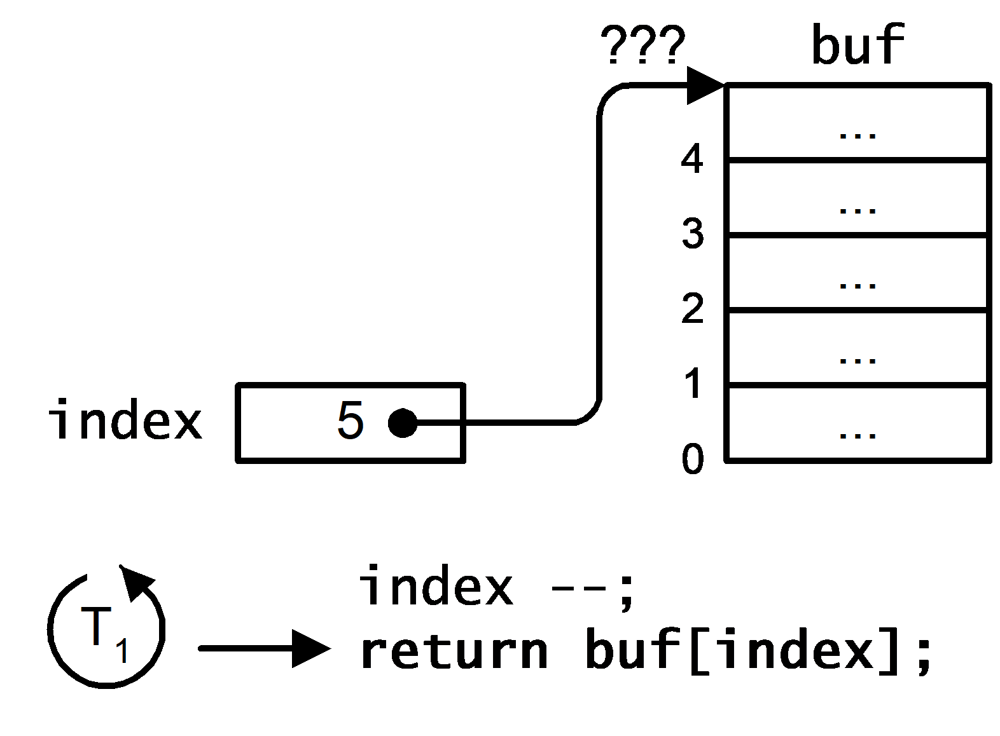

# Der gegenseitige Ausschluss (Mutual Exclusion)

[Zurück](../../Readme.md)

Aus *Wikipedia*:

"Der Begriff "**gegenseitiger Ausschluss**" bzw. *Mutex* (Abk. für engl. *Mutual Exclusion*) bezeichnet eine Gruppe von Verfahren,
mit denen das Problem des kritischen Abschnitts gelöst wird.
Mutex-Verfahren verhindern, dass nebenläufige Prozesse bzw. Threads gleichzeitig oder zeitlich verschränkt
gemeinsam genutzte Datenstrukturen unkoordiniert verändern, wodurch die Datenstrukturen in einen inkonsistenten Zustand geraten können,
auch wenn die Aktionen jedes einzelnen Prozesses oder Threads für sich betrachtet konsistenzerhaltend sind.

Mutex-Verfahren koordinieren den zeitlichen Ablauf nebenläufiger Prozesse/Threads derart,
dass andere Prozesse/Threads von der Ausführung kritischer Abschnitte ausgeschlossen sind,
wenn sich bereits ein Prozess/Thread im kritischen Abschnitt befindet (die Datenstruktur verändert)."

---

In [Visual C#](https://amazon.de/Objektorientiertes-Programmieren-methodische-Einführung-Fortgeschrittene/dp/3866454066)
gibt es eine ausführliche Beschreibung zum Thema *Mutual Exclusion*, das dort
die Programmiersprache C# zugrunde legt. Die Ausführungen lassen sich ohne Weiteres auch auf andere
Programmiersprachen übertragen, wie zum Beispiel C++.

---

#### Quellcode:

  * Elementare Demonstration des `std::mutex` Objekts:</br>
    [Beispiel einer Klasse `Counter`](Simple_Mutex.cpp).

  * Elementare Demonstration des `std::condition_variable` Objekts:</br>
    [Beispiel](Simple_Condition_Variable.cpp).

  * Demonstration des klassischen Konsumenten/Verbraucher-Problems:</br>
    [Beispiel einer Klasse `ConsumerProducerOne::ConsumerProducer`](Producer_Consumer_01.cpp).</br>
    [Beispiel einer Klasse `ConsumerProducerTwo::ConsumerProducer`](Producer_Consumer_02.cpp).</br>
    [Beispiel einer Klasse `ConsumerProducerThree::ConsumerProducer`](Producer_Consumer_03.cpp).</br>

---

**Beachte**:

Siehe das Thema

[Do I have to acquire lock before calling std::condition_variable.notify_one()?](https://stackoverflow.com/questions/17101922/do-i-have-to-acquire-lock-before-calling-condition-variable-notify-one)

---

## Konkurrierender Zugriff auf Objekte 

### Probleme des konkurrierenden Zugriffs auf ein Objekt

Im letzten Kapitel haben wir eine Variable betrachtet, die durch mehrere Threads
schreibend oder lesend in die Mangel genommen wurde.
In diesem Kapitel drehen wir den Spieß um und wenden uns Objekten zu,
verbunden mit der Fragestellung:
Dürfen eine oder unterschiedliche Methoden desselben Objekts jederzeit - ohne Auftreten von Fehlern - von mehreren Threads durchlaufen werden?
Wie im letzten Abschnitt nähern wir uns der detaillierten Analyse dieser Frage wieder mit einem einfachen Beispiel,
um potentielle kritische Situationen exakt darlegen zu können.
In
*Listing* 1 stellen wir eine möglichst einfache - und damit für anspruchsvollere Programme auch nicht
sonderlich geeignete - Implementierung eines Stapels bereit
mit der Intention, seine `Push`- und `Pop`-Methode
intensiv einem Belastungstest durch mehrere Threads auszusetzen:
      

```cpp
01: class Stack
02: {
03:     private int[] buf;
04:     private int index;
05: 
06:     public Stack ()
07:     {
08:         this.buf = new int[10];
09:         this.index = 0;
10:     }
11: 
12:     public void Push (int n)
13:     {
14:         if (this.IsFull ())
15:             return;
16: 
17:         this.buf[this.index] = n;
18:         this.index ++;
19:     }
20: 
21:     public int Pop () 
22:     {
23:         if (this.IsEmpty ())
24:             return -1;
25: 
26:         this.index --;
27:         return this.buf[this.index];
28:     }
29: 
30:     public bool IsEmpty () 
31:     {
32:         return this.index == 0;
33:     }
34: 
35:     public bool IsFull () 
36: 
37:     {
38:         return this.index == this.buf.Length;
39:     }
40: }
```

###### Listing 1: Einfache Implementierung eines Stapels.

Die Realisierung des Stapels in
*Listing* 1
basiert ganz schlicht auf einem `int`-Array fester Länge,
das die abzuspeichernden `int`-Elemente unter Zuhilfenahme eines Positionszeigers verwaltet.
Damit die beiden Operationen
`Push` und `Pop` ohne Verletzung der Arraygrenzen ausgeführt werden können,
besitzt die `Stack`-Klasse zusätzlich
die Methoden `IsEmpty` und `IsFull`.
Im Mittelpunkt des Stresstests stehen die Methoden `Push` und `Pop`,
wir lassen sie mit den folgenden zwei Stressmethoden
`FillStack` und `EmptyStack` aus der Klasse `StressClient`
zu einem Belastungstest "gegeneinander" antreten
(*Listing* 2):
      

```cpp
01: class StressClient
02: {
03:     public static void FillStack (Object o)
04:     {
05:         Stack s = (Stack) o;
06:         for (int i = 0; i < Int32.MaxValue; i ++)
07:             s.Push (i);
08:     }
09: 
10:     public static void EmptyStack (Object o)
11:     {
12:         Stack s = (Stack) o;
13:         for (int i = 0; i < Int32.MaxValue; i ++)
14:             s.Pop ();
15:     }
16: }
```

###### Listing 2: Die Klasse `StressClient` mit den Stressmethoden `FillStack` und `EmptyStack`


Die Methode `FillStack` versucht ununterbrochen, ein Element auf dem Stapel abzulegen.
Zum Ausgleich trägt die Methode `EmptyStack` pausenlos dazu bei, vorhandene Elemente vom Stapel wieder zu entfernen.
Beide Stressmethoden halten sich an die Spielregeln der `Stack`-Klasse, da bei jedem Aufruf von
`Push` bzw. `Pop`
mit dem entsprechenden Aufruf von `IsEmpty` bzw. `IsFull`
die Integrität des Stapels überprüft wird.
Vor dem Hintergrund der Fragestellung dieses Kapitels lassen wir die zwei Methoden `FillStack` und
`EmptyStack` in
*Listing* 3
nebenläufig im Kontext zweier Threads laufen:
      

```cpp
01: class Program
02: {
03:     public static void Main()
04:     {
05:         ParameterizedThreadStart ps1 =
06:             new ParameterizedThreadStart(StressClient.FillStack);
07:         ParameterizedThreadStart ps2 =
08:             new ParameterizedThreadStart(StressClient.EmptyStack);
09: 
10:         Thread t0 = new Thread(ps1);
11:         Thread t1 = new Thread(ps2);
12: 
13:         Stack s = new Stack();
14: 
15:         t0.Start(s);
16:         t1.Start(s);
17: 
18:         t0.Join();
19:         t1.Join();
20:     }
21: }
```

###### Listing 3: Zwei Threads testen die Klasse `Stack`.

Einige Programmläufe der `StressTest`-Methode aus
*Listing* 3
verursachen keine Auffälligkeiten, andere hingegen beenden die Programmausführung vorzeitig mit
folgenden Fehlermeldungen in der Konsole:
      
```
Unhandled Exception: System.IndexOutOfRangeException:
Index was outside the bounds of the array.
   at Stack.Pop() in d:\Synchronisation.cs:line 27
   at StressClient.EmptyStack() in d:\Synchronisation.cs:line 103
```

Wir erkennen an den Ausnahmen, dass der Zugriff auf das `buf`-Array mit einem unzulässigen Index erfolgte.
Auf der anderen Seite ist jeder Aufruf von `Push` oder `Pop` mit einer entsprechenden
Vorsichtsmaßnahme (Aufruf von `IsEmpty` bzw. `IsFull`) geschützt.
Wie kann es trotzdem zu Ausnahmen kommen? Wir analysieren zu diesem Zweck eine ganz bestimmte Folge
von `Push`- und `Pop`-Aufrufen,
wie sie in der Praxis auftreten könnte und garnieren das Ganze natürlich geschickt mit zwei Threadwechseln.
Unsere Ausgangssituation finden Sie in
*Abbildung* 1
vor: Der aktive Thread T<sub>1</sub> hat die `Pop`-Methode betreten und
den Positionszeiger bereits dekrementiert. Dabei spielt es keine Rolle, an welcher Position im Stapel
wir uns augenblicklich befinden.
      


*Abbildung* 1: Die Ausführung der `Pop`-Methode wird im Kontext von Thread T<sub>1</sub> nach dem Dekrementieren des Positionszeigers unterbrochen.

Wie Sie vermutlich erwarten, verdrängen wir nun Thread T<sub>1</sub>, sprich die noch ausstehende Anweisung
      
```
return buf[index];
```

in der `Pop`-Methode kommt erst zu einem späteren Zeitpunkt zum Zuge.
Bitte beachten Sie: Wir verletzen bereits zum jetzigen Zeitpunkt die Integrität des Stapelobjekts,
da eine nun folgende `Push`-Operation genau das Element im Stapel überschreibt, das
von der zuvor unterbrochenen `Pop`-Methode noch zurückzuliefern ist.
Wenn gleich bereits dieser Fehler inakzeptabel ist, führt er zumindest noch nicht zu einem Absturz der
`Push`-Methode. Wir treiben die Analyse deshalb noch ein Stück voran,
um auch noch dem zweiten Fehler auf die Spur zu kommen.
      
An den Thread T<sub>2</sub>, der nun das Stapelobjekt betritt und eine Reihe von `Push`-Operationen durchführt,
stellen wir keine besonderen Ansprüche - von einer Ausnahme abgesehen:
Vor der erneuten Zuteilung der Programmausführung
an Thread T<sub>1</sub> muss der Stapel voll sein. Der Positionszeiger `index` muss folglich den Wert 5 besitzen,
siehe *Abbildung* 2:
      


*Abbildung* 2: Nach mehreren `Push`-Aufrufen im Kontext von Thread T<sub>2</sub> ist das Stapelobjekt voll, der Positionszeiger besitzt den Wert 5..

Wir kehren zurück zu Thread T<sub>1</sub>.
Dieser hatte beim letzten Threadwechsel die `Pop`-Methode noch nicht vollständig abgearbeitet,
der Zugriff auf das `int`-Array in der Anweisung
      
```
return buf[index];
```
      
mit Positionszeiger 5 führt nun zum Eintreten
einer `IndexOutOfRangeException`-Ausnahme im Stapelobjekt
(*Abbildung* 3):
      



*Abbildung* 3: Das Wiederaufsetzen in der `Pop`-Methode führt zu einem Absturz, da ein Zugriff auf das Datenarray `buf` mit Index 5 nicht zulässig ist.

Wir erkennen an diesem Beispiel, dass die Unterbrechung der `Pop`-Methode
im Zusammenspiel mit einem Threadwechsel dazu führt, dass der interne Zustand des Stapelobjekts fehlerhaft wird.
Die Integrität des Stapelobjekts wird auf der anderen Seite aber nur dann verletzt, wenn sich zwei Ausführungen
der `Push` und `Pop`-Methode im Kontext *unterschiedlicher* Threads überlappen.
Wir sind bei einem der elementarsten Probleme der Parallelprogrammierung angelangt,
dem Wunsch nach dem *gegenseitigen Ausschluss* (engl. *mutual exclusion*) zweier Aktionen.
      

Um den .NET-Entwickler bei solch grundlegenden Problemen nicht im Regen stehen zu lassen, gibt es ab dem .NET-Framework einen neuen
Namensraum `System.Collections.Concurrent`,
der unter anderem eine thread-sichere Stapelklasse `ConcurrentStack<>` enthält.

Mit ihrem Einsatz können wir die mit viel Mühe konzipierte Klasse `Stack` aus
*Listing* 3 getrost zur Seite legen.

Sollten Sie noch nicht das endgültige Vertrauen in die Thread-Sicherheit dieser Klasse haben,
können Sie ja den Testrahmen aus *Listing* 4
anpassen und stattdessen ein `ConcurrentStack<>`-Objekt testen:
      

```cpp
01: class StressClient
02: {
03:     public static void FillStack (Object o)
04:     {
05:         ConcurrentStack<int> s = (ConcurrentStack<int>)o;
06:         for (int i = 0; i < Int32.MaxValue; i ++)
07:             s.Push (i);
08:     }
09: 
10:     public static void EmptyStack (Object o)
11:     {
12:         ConcurrentStack<int> s = (ConcurrentStack<int>)o;
13:         int data;
14:         for (int i = 0; i < Int32.MaxValue; i++)
15:             s.TryPop(out data);
16:     }
17: }
18: 
19: class Program
20: {
21:     public static void Main()
22:     {
23:         ParameterizedThreadStart ps1 =
24:             new ParameterizedThreadStart(StressClient.FillStack);
25:         ParameterizedThreadStart ps2 =
26:             new ParameterizedThreadStart(StressClient.EmptyStack);
27: 
28:         Thread t0 = new Thread(ps1);
29:         Thread t1 = new Thread(ps2);
30: 
31:         ConcurrentStack<int> s = new ConcurrentStack<int>();
32: 
33:         t0.Start(s);
34:         t1.Start(s);
35: 
36:         t0.Join();
37:         t1.Join();
38:     }
39: }
```

###### Listing 4: Die thread-sichere Klasse `ConcurrentStack<>`


### Kritische Abschnitte und das Monitorprinzip

In der Betriebssystemprogrammierung bezeichnet man Codesequenzen, die sich während ihrer Ausführung nicht überschneiden dürfen,
als *kritischen Abschnitt* (engl. *critical section*).

Die Behandlung des gegenseitigen Ausschlusses erfolgt in .NET mit dem so genannten *Monitorprinzip*
Dieses Konzept geht ursprünglich von Edsger Wybe Dijkstra konzipiert
und 1965 in seinem Artikel "Cooperating sequential processes" vorgestellt.

Dijkstra war ein niederländischer Informatiker, unter anderem Wegbereiter der strukturierten Programmierung,
Erfinder eines nach ihm benannten Algorithmus zur Berechnung eines kürzesten Weges in einem Graphen
und an der Einführung des Moitorkonzepts zur Synchronisation von Threads beteiligt.


*Abbildung* 4: Edsger W. Dijkstra, 2002.

      
Anschaulich betrachtet kann man sich unter einem Monitor ein Gebäude vorstellen, das aus drei Räumen besteht
(siehe *Abbildung* 5).
Im Mittelpunkt dieses Gebäudes befindet sich der *Behandlungsraum*,
ein spezieller Raum, der zu einem bestimmten Zeitpunkt nur von einem Thread
betreten werden darf. In der Regel erfolgt in diesem Raum der Zugriff auf die sensiblen Daten eines Objekts,
dessen Integrität durch den Monitor zu gewährleisten ist.
Da in einem Umfeld paralleler Aktivitäten stets mehrere Threads um den Zugang zum Monitor konkurrieren können,
kann der Behandlungsraum nur über ein *Wartezimmer* betreten werden.
Im Wartezimmer können sich natürlich mehrere Threads aufhalten,
in den Behandlungsraum kann aber immer nur genau ein Thread eintreten.
In der Zeit, die sich vom Betreten des Behandlungsraums bis hin zum Verlassen erstreckt,
hat dieser Thread exklusiven Zugriff zu allen Daten des Objekts.
Vom Behandlungszimmer verzweigt noch eine Türe zu einem *Interimsraum*.
Dieses Zimmer ist für die Zusammenarbeit von mehreren Threads von Bedeutung, auf die wir noch
zu sprechen kommen.
      


*Abbildung* 5: Anschauliche Darstellung eines Monitors: Ein Gebäude mit drei Räumen, in dem sich beliebig viele Threads nach bestimmten Spielregeln bewegen dürfen..

Einige Hinweise zur Begriffsbildung in diesem Zusammenhang:
Das Betreten des Monitorgebäudes bezeichnet man auch als "den Monitor betreten" (engl. *entering the monitor*),
das Betreten des Behandlungsraums wird als "den Monitor belegen" (engl. *acquiring the monitor*) bezeichnet.
Der einzige Thread, der sich zu einem bestimmten
Zeitpunkt im Behandlungsraum aufhält, "besitzt den Monitor" (engl. *owning the monitor*).
Dieser Thread wird auch der "aktive Thread" des Monitors genannt (engl. *active thread*).
Das Verlassen des Behandlungsraums nennt man "den Monitor freigeben" (engl. *releasing the monitor*),
das Verlassen des gesamten Monitorgebäudes
rangiert unter der Formulierung "den Monitor verlassen" (engl. *exiting the monitor*).
    
Neben den Daten, die ein Monitor schützt, ordnet man einem Monitor auch eine Reihe von Operationen zu,
die wir im folgenden als *Monitoroperationen* bezeichnen wollen. Eine Monitoroperation bezeichnet eine Folge von Anweisungen,
die (in Bezug auf einen bestimmten Monitor) als unteilbare Operation auszuführen sind.
Anders ausgedrückt: Ein Thread muss
in der Lage sein, eine Monitoroperation vom Anfang bis zum Ende ausführen zu können, ohne dass ein anderer Thread zur selben
Zeit ebenfalls eine Operation desselben Monitors ausführt.
Ein Monitor erzwingt eine
"*one-thread-at-a-time*"-Ausführung aller seiner Monitoroperationen.

Die einzige Möglichkeit, um einen Monitor betreten zu können, besteht darin,
dass ein Thread in seinem Kontext eine der Monitoroperationen aufruft.
Zu diesem Zweck bedarf es einer speziellen Anweisung am Anfang der Monitoroperation,
die dem Thread den Eintritt in das Wartezimmer des Monitors ermöglicht.
Technisch formuliert heißt das, dass der Thread blockiert wird und seine
Referenz in einer Warteschlange abgelegt wird.
Diese Queue bezeichnen wir als *Eingangswarteschlange* (engl. *entry queue*),
sie ist natürlich mit der Eingangshalle des Monitorgebäudes gleichzusetzen,
die wir in *Abbildung* 5
zur Veranschaulichung des Monitorprinzips herangezogen haben.
Um in der Monitoroperation weiter voranschreiten zu können, muss der Monitor nun belegt werden.
Wenn in der Eingangswarteschlange kein weiterer Thread eingetragen ist und auch kein Thread den Monitor belegt,
kann dieser Thread sofort den Monitor belegen und damit in der Ausführung der Monitoroperation fortfahren.
Ist die Eingangswarteschlange
nicht leer, muss der neu angekommene Thread sich damit begnügen,
solange blockiert zu bleiben, bis der Thread, der den Monitor belegt, diesen freigibt und verlässt.
Nun obliegt es der Verwaltung des Monitors, einem der wartenden Threads aus der Eingangswarteschlange
die Belegung des Monitors zu gewähren.
    


*Abbildung* 6: Erste Veranschaulichung eines Monitors: Aspekt des gegenseitigen Ausschlusses..

In 
*Abbildung* 6
haben wir das Prinzip des Monitors aus dem Blickwinkel seiner technischen Realisierung veranschaulicht:
In der linken Hälfte finden wir die Warteschlange aller wartenden Threads vor, es sind dort aktuell die Threads
T<sub>1</sub>, T<sub>2</sub> und T<sub>3</sub> abgelegt.
Der Zugang zum Monitor erfolgt durch Öffnung Nummer 1, auf die technischen Details des Zutritts
kommen wir noch zu sprechen.
Besitzer eines Monitors kann zu einem Zeitpunkt immer nur ein Thread sein,
dieser schreitet nach dem Austragen seiner Referenz aus der Eingangswarteschlange durch Öffnung Nummer 2
und wird in
*Abbildung* 6
in der rechten Hälfte als *Owner* dargestellt (hier: Thread T<sub>4</sub>).
Gibt der Besitzer den Monitor frei, wird dieser durch Öffnung Nummer 3 verlassen.
    

### Betreten und Verlassen eines Monitors

Monitore werden im .NET Framework durch die Klasse `Monitor` aus dem
Namensraum `System.Threading` zur Verfügung gestellt.
Die beiden Methoden zum Betreten und Verlassen des Monitors wurden mit den Bezeichnungen
`Enter` und `Exit` versehen, siehe *Tabelle* 1:


| Methode | Beschreibung |
|:-------------- |----|
| Methode ``Enter`` | ```public static void Enter (Object obj);```<br/> Betritt und belegt das durch `obj` spezifizierte Monitorobjekt. Durch das Belegen des Monitors wird insbesondere ein kritischer Abschnitt eingeleitet, der verhindert, dass andere Monitoroperationen zur Ausführung gelangen können. |
| Methode ``Exit`` | ```public static void Exit (Object obj);```<br/> Freigabe und Verlassen des durch `obj` spezifizierten Monitorobjekts. Insbesondere ist der kritische Abschnitt der aktuellen Monitoroperation beendet und andere Threads können nun den Monitor belegen. |

*Tabelle* 1: `Enter`- und `Exit`-Methode der Klasse `Monitor`.

Unter Einbeziehung der `Monitor`-Klasse sieht eine thread-sichere Implementierung von `Push` oder `Pop` nun so aus:
      

```cpp
01: public void Push (int n)
02: {
03:     Monitor.Enter (this);
04:     if (this.IsFull ())
05:     {
06:         Monitor.Exit (this);
07:         return;
08:     }
09: 
10:     this.buf[this.index] = n;
11:     this.index ++;
12:     Monitor.Exit (this);
13: }
14: 
15: public int Pop () 
16: {
17:     Monitor.Enter (this);
18:     if (this.IsEmpty ())
19:     {
20:         Monitor.Exit (this);
21:         return -1;
22:     }
23: 
24:     this.index --;
25:     int val = this.buf[index];
26:     Monitor.Exit (this);
27:     return val;
28: }
```

###### Listing 5: Der gegenseitige Ausschluss der `Push`- und `Pop`-Methoden mit Hilfe eines Monitors

In den Zeilen 3, 6, 12, 17, 20 und 26 von
*Listing* 5 fällt auf,
dass die beiden Methoden `Enter` und `Exit`
genau dann zu synchronisieren sind, wenn sie sich auf dasselbe Stapelobjekt beziehen, deshalb die
Verwendung der `this`-Referenz.
      

*Hinweis*:
*Listing* 5 stellt ein gutes Beispiel dar, um auf eine der häufigsten und fatalsten Fehlerquellen im Umfeld der Programmierung
mit Monitoren hinzuweisen. Wenn wir einen kritischen Abschnitt
(mit `Enter`) betreten,
dürfen wir beim Verlassen nicht vergessen, die korrespondierende `Exit`-Methode aufzurufen.
Ein flüchtiger Blick auf 
*Listing* 5 
zeigt, dass die entsprechenden Methodenaufrufe in den Zeilen 12 bzw. 26 platziert sind.
Vorsicht: Die
`Push`- und `Pop`-Methode besitzen jeweils einen zweiten Ausgang (falls der Stapel voll oder leer ist).
Der kritische Abschnitt muss für diesen Fall ebenfalls korrekt mit einem Aufruf der `Exit`-Methode verlassen werden,
wie in den Zeilen 6 und 20 erkennbar ist. Eine fehlerhafte Implementierung der `Push`-Methode, etwa der Gestalt
        
```
public void Push (int n)
{
    Monitor.Enter (this);
    if (this.IsFull ())
        return;

    this.buf[this.index] = n;
    this.index ++;
    Monitor.Exit (this);
}
```
        
hätte zur Folge, dass alle nachfolgenden Aufrufe von `Push` und `Pop` (im Kontext anderer Threads)
blockiert werden - in vielen Fällen resultiert daraus ein Stillstand der gesamten Anwendung!
Zur Vermeidung derartiger Fehlerquellen gibt es in C# das `lock`-Sprachelement, das
        
  * das Betreten eines Monitors,
  * die Ausführung eines Anweisungsblocks,
  * und das (garantierte) Verlassen des Monitors

in einer Anweisung zusammenfasst:
       
```
lock (expression)
    statement_block;
```
        
Auf unser Beispiel mit der Klasse `Stack` bezogen, könnten die beiden
Methoden `Push` und `Pop` damit alternativ auch wie in
*Listing* 6 implementiert werden:
        

```cpp
01: public void Push (int n)
02: {  
03:     lock (this)
04:     {
05:         if (this.IsFull ())
06:             return;
07: 
08:         this.buf[this.index] = n;
09:         this.index ++;
10:     }
11: }
12: 
13: public int Pop () 
14: {
15:     lock (this)
16:     {
17:         if (this.IsEmpty ())
18:             return -1;
19: 
20:         this.index --;
21:         return this.buf[this.index];
22:     }            
23: }
```

###### Listing 6: Alternative Implementierung der `Push`- und `Pop`-Methode mit `lock`: 

Natürlich wird das `lock`-Sprachelement vom C#-Compiler wiederum auf die statischen Methoden
`Enter` und `Exit` der `Monitor`-Klasse abgebildet.
Die Umsetzung sieht schematisch betrachtet unter Verwendung eines Bezugsobjekts `obj` so aus:
        
```
Monitor.Enter (obj);
try {
   ...
}
finally {
   Monitor.Exit (obj);
}
```
        
Ähnlich wie beim Problem der atomaren Operation
müssen wir leider auch bei der nicht vermeidbaren Verwendung von Monitoren zur Kenntnis nehmen,
dass die Laufzeit der Anwendung zu leiden beginnt. Um ein Gefühl für das Maß der Verschlechterung zu erlangen,
ergänzen wir das Beispiel des Stresstests 
um entsprechende Laufzeitmessungen. Mit einem Wiederholungsfaktor von 10000000
`Push`- und `Pop`-Methodenaufrufen messen wir eine Laufzeit von ca. 6 Sekunden
im Gegensatz zu 1 Sekunde ohne Einsatz eines Monitors. Dieser Grad der Verschlechterung ist dennoch nicht
repräsentativ, da der Stresstest ausschließlich ununterbrochen die beiden kritischen Methoden aufruft, eine Situation,
die in einer realen Anwendung in dieser Form nicht gegeben ist!
      

## Zusammenarbeit von Threads

Eine Anwendung mit einer grafischen Oberfläche kann beispielsweise eine umfangreiche Berechnung an einen Thread
delegieren. Die Anwendung bleibt dadurch reaktionsfähig, der Benutzer kann jederzeit durch entsprechende Bedienungen
(Maus-, Tastaturereignisse) mit der Anwendung kommunizieren.
Wenn der Thread mit seinen Berechnungen fertig ist, kann die Oberfläche aktualisiert werden.
Natürlich ist die Aktualisierung erst dann vorzunehmen, wenn der Thread seine Berechnungen erfolgreich abgeschlossen hat
und eine entsprechende Benachrichtigung (an einen möglicherweise wartenden Ausgabethread) übertragen hat.
Es ist nicht zufällig, dass in den letzten Sätzen die Wörter *warten* und *benachrichtigen* verwendet wurden.
Sie bringen das für die Thread-Kooperation zentrale Konzept zum Ausdruck:
Ein Thread *wartet* darauf, dass bestimmte Voraussetzungen geschaffen werden,
andere Threads führen temporäre Dienstleistungen aus und *benachrichtigen* wartende Threads mit ihren Resultaten.
    


### Erweiterung des Monitorprinzips: Der Interimsraum

Mit den bislang
beschriebenen Mechanismen des Monitorprinzips erreichten wir das Ziel
des gegenseitigen Ausschlusses eines kritischen Abschnitts im Umfeld eines Multithreadingszenarios.
Zu einem bestimmten Zeitpunkt kann nur ein Thread eine Monitoroperation (eines bestimmten Monitors) ausführen.
Dieses Verfahren ist dann von Bedeutung, wenn mehrere Threads auf gemeinsame Daten zugreifen.
Das zweite Thema bezüglich der Synchronisierung von Threads ist ihre Koordination.
Sie unterstützt mehrere Threads beim Erreichen eines gemeinsamen Ziels.
Die Koordination von Threads ist dann von Bedeutung, wenn ein Thread Daten in einem bestimmten Zustand benötigt und
ein anderer Thread dafür verantwortlich ist, die Daten in genau diesem Zustand zur Verfügung zu stellen.
Zum Beispiel können wir uns einen Thread vorstellen ("*Reader-Thread*"), der Daten aus einem Puffer
auslesen möchte, der von einem zweiten Thread ("*Writer-Thread*") gefüllt wird.
Der Reader-Thread benötigt den Puffer im Zustand "*not empty*", bevor er Daten lesen kann.
Wenn der Reader-Thread feststellt, dass der Puffer leer ist, muss er warten (Zustand "*empty*").
Der Writer-Thread ist dafür zuständig, den Puffer zu füllen und ggf. wartende Threads zu benachrichtigen,
dass der Puffer im Zustand "*not empty*" ist.
      
Wir sind nun bei einer Funktionalität des Monitors angekommen, die im Jargon der Betriebssystemtheorie
als "*Signal and Continue*"-Monitor bezeichnet wird
oder mit Blick auf .NET-Namensgebungen auch "*Wait and Pulse*"-Monitor heißen könnte.
In diesem Typus Monitor kann sich ein Thread, der den Monitor gerade belegt, suspendieren,
indem er eine *Wait*-Aktion anstößt.
Wenn ein Thread die *Wait*-Aktion ausführt, gibt er den Monitor frei und reiht sich in einer zweiten Warteschlange
des Monitorgebäudes ein, der so genannten *Bedingungswarteschlange* (engl. *condition queue*),
in der angelsächsischen Fachliteratur auch als *wait queue* bezeichnet. 
Das Einreihen in der Bedingungswarteschlange bedeutet einfach, dass die Daten des Monitors für diesen Thread gerade
in einem unpassenden Zustand sind. Der Thread wartet somit, bis auf Grund einer Zustandsänderung der Daten
eine bestimmte Bedingung erfüllt ist, die ein Weiterarbeiten wieder sinnvoll macht.
Ein Thread muss in der Bedingungswarteschlange solange warten, bis ein anderer Thread, der den Monitor belegt,
eine *Pulse*-Aktion
ausführt. Mit dieser Aktion gibt dieser Thread kund, dass die Daten des Monitors ihren Zustand geändert haben.
Wenn ein Thread eine *Pulse*-Aktion ausführt, muss er deswegen den Monitor nicht sofort verlassen.
Er führt in der Regel seine Monitoroperation bis zum Ende aus und verlässt erst dann den Monitor.
Wenn der benachrichtigende Thread
den Monitor freigegeben hat, wird einer der blockierten Threads aufgeweckt, um den Monitor erneut zu belegen.
      


*Abbildung* 7: Zweite, vollständige Veranschaulichung eines Monitors: Aspekt der Koordination von Threads.

In 
*Abbildung* 7 erkennen wir 
einige Ergänzungen, die dem Aspekt der Koordination von Threads dienen.
Stellt beispielsweise der aktive Thread des Monitors fest, dass er die Monitoroperation auf Grund eines ungeeigneten
Datenzustands nicht beenden kann, gibt er den Monitor mit dem Aufruf einer *Wait*-Aktion frei
und begibt sich durch Öffnung 4 in den Interimsraum des Monitors.
Diesen Begriff haben wir gewählt, um damit die Bedingungswarteschlange des Monitors zu veranschaulichen.
Sie nimmt alle Threads auf, die auf ein
bestimmtes Ereignis warten und deshalb den Monitor noch nicht verlassen möchten.
Irgendwann gibt es einen aktiven Thread im Monitor, der die Daten geeignet ändert
und in Folge dessen eine *Pulse*-Aktion auslöst.
Damit kann einer der Threads aus der Bedingungswarteschlange entnommen werden
und den Monitor durch Öffnung 5 erneut belegen.
      
 Mit Hilfe von *Abbildung* 7 können wir den internen Aufbau eines Monitors exakter beschreiben. Er enthält
      
  * ein Threadobjekt, das den Monitor im Augenblick belegt,
  * eine *Entry Queue*, die alle Threads enthält, die den Monitor belegen wollen und
  * eine *Condition Queue*, die alle Threads enthält, die auf Benachrichtigungen warten, die auf einen Zustandswechsel in den Daten des zu schützenden Objekts hindeuten.

Wir kommen noch einmal auf das Beispiel mit dem Reader- und dem Writer-Thread zurück
und legen zu Grunde, dass zwei Operationen "*Read Data*" und "*Write Data*"
unter der Kontrolle eines Monitors ablaufen.
Betritt ein Reader-Thread den Monitor, überprüft er zunächst den Zustand des Datenpuffers, oder etwas allgemeiner formuliert:
Es wertet die Bedingung "*buffer empty*" aus. Ist der Puffer nicht leer, kann der Reader-Thread 
mit der "*Read Data*"-Operation Daten aus dem Puffer entnehmen und anschließend den Monitor verlassen.
Ist der Puffer jedoch leer, führt der Reader-Thread eine *Wait*-Aktion aus.
In diesem Fall gibt der Reader-Thread den Monitor frei, suspendiert sich und wird in der Bedingungswarteschlange des Monitors
eingetragen.
Zu einem späteren Zeitpunkt betritt der Writer-Thread den Monitor, legt einige Daten im Puffer ab, führt eine *Pulse*-Aktion
aus und verlässt schließlich den Monitor.
Bei der Ausführung des *Pulse*-Kommandos wird der blockierte Zustand des Reader-Threads aufgehoben,
er kann beim nächsten Threadwechsel wieder die Kontrolle übertragen bekommen.
Da die Bedingungswarteschlange aber mehrere Threads enthalten kann, die alle Daten aus dem Puffer entnehmen wollen,
muss der Reader-Thread beim Belegen des Monitors zunächst überprüfen, ob der Puffer auch tatsächlich im Zustand
"*not empty*" vorliegt.
Ein *Pulse*-Kommando kann folglich nur als *Hinweis* für wartende Threads verstanden werden,
dass die Daten im gewünschten Zustand vorliegen.
Sind im Puffer Daten abgelegt, kann der Reader-Thread diese entnehmen und danach
den Monitor wieder verlassen.

Zum Abschluss dieser Betrachtungen werfen wir in
*Abbildung* 8 einen Blick auf die Zustände,
die ein Thread bei seinem Parcour durch das Monitorgebäude einnehmen kann.
Wir erkennen, dass ein Thread im Wartezimmer zunächst den Zustand `Ready` besitzt.
Die Belegung des Monitors bedeutet, dass der Thread in den Zustand `Running` übergeht.
Natürlich kann auch der Besitzer eines Monitors in seiner Arbeit unterbrochen werden.
Beispielsweise zu Gunsten von anderen Threads im System,
die vorübergehend eine höhere Priorität besitzen und mit dem Monitor nicht in Zusammenhang stehen.
In dieser Situation nimmt der Besitzer des Monitors den Zustand `Ready` ein,
ohne dabei allerdings wieder im Wartezimmer Platz zu nehmen.
Solange der Besitzer des Monitors diesen nicht freigibt,
kann kein anderer Thread aus dem Wartezimmer in die Rolle des Besitzers schlüpfen.
Möchte der Besitzer des Monitors diesen freigeben, um sich im Sinne der Zusammenarbeit mit anderen Threads aus dem
Wartezimmer zu koordinieren, kann er im Interimsraum des Monitors Platz nehmen - er nimmt dazu den Zustand `Blocked` an.
Blockierte Threads können - entweder alle oder nur einer - den Interimsraum wieder verlassen,
sie müssen dann mit einem kleinen Umweg über das Wartezimmer
(Zustand `Ready`) darauf warten, bis sie wieder den Monitor belegen dürfen.
      


*Abbildung* 8: Die Zustände, die ein Thread in einem Monitor annehmen kann.

*Hinweis*:
Halten sich im Interimsraum eines Monitors mehrere Threads auf, ist es nicht möglich, gezielt einen bestimmten Thread
aus seiner Blockade aufzuwecken. Entweder es können alle Threads auf einmal in das Wartezimmer gehen,
oder aber es wird ein Thread von der Verwaltungsinstanz des Monitors nach dem Zufallsprinzip bestimmt - beziehungsweise nach Kriterien,
die für den Monitor deterministisch erscheinen mögen, aber eben von außen nicht vorhersehbar sind.


### Benachrichtigungen über Zustandsänderungen eines Monitorobjekts

Zur Koordination von Threads stehen in der `Monitor`-Klasse die drei Methoden
`Pulse`-, `PulseAll`- und `Wait`-Methode zur Verfügung (*Tabelle* 2).
Mit `Wait` versetzt sich ein Thread solange in einen inaktiven Zustand,
bis im Monitorobjekt eine geeignete Zustandsänderung eingetreten ist.
Zur Reaktivierung wartender Threads gibt es die beiden Methoden `Pulse` und `PulseAll`:

| Methode | Beschreibung |
|:-------------- |----|
| Methode ``Wait`` | ```public static bool Wait (Object obj);```<br/>Gibt das durch `obj` spezifizierte Monitorobjekt frei, so dass andere Threads dieses belegen können. Der aktuelle Thread geht in einen blockierten Zustand über. Mit Hilfe von `Pulse`-Methodenaufrufen aus dem Kontext anderer Threads kann ein Wechsel im Zustand des aktuellen Objekts signalisiert werden und der zuletzt aktive Thread wieder reaktiviert werden. |
| Methode ``Pulse`` | ```public static void Pulse (Object obj);```<br/>Sendet ein Signal an einen (`Pulse`) oder alle (`PulseAll`) blockierten Threads des durch `obj` spezifizierten Monitorobjekts. Mit diesem Signal ist zusätzlich ein Wechsel im Zustand des zu schützenden Objekts verbunden. In der Regel gibt der aktuelle Inhaber des Monitors diesen in Kürze frei, da das *Pulse*-Signal als Aufforderung für andere Threads zu verstehen ist, ihre Arbeit fortzusetzen. |

*Tabelle* 2: Die `Pulse`-, `PulseAll`- und `Wait`-Methode der Klasse `Monitor`.

Damit kommen wir zur den Formulierungen einer Monitoroperation in C#.
Die Überprüfung des Datenzustandes können wir uns mit einer Bedingungsvariablen `condition` vom
Typ `bool` verknüpft vorstellen.
Die Bedingung muss solange wahr bleiben, wie der Thread fortgesetzt werden soll.
Ist die Bedingung nicht mehr erfüllt, muss der Thread warten, bis sie wieder `true` ist,
um fortgesetzt zu werden.
In C# formuliert man dieses Szenario - beispielsweise in einer Methode `DoWhenCondition` - so:    

```cpp
01: void DoWhenCondition ()
02: {
03:     Monitor.Enter (this);  // acquire a lock for this object
04: 
05:     while (! condition)
06:     {
07:         Monitor.Wait (this);  // wait until the state
08:                               // of this object has changed
09:     }
10: 
11:     /* do what needs to be done       */
12:     /* when the condition is true ... */
13: 
14:     Monitor.Exit (this);  // release the lock on this object
15: }
```

###### Listing 7: Aussehen einer Monitoroperation mit passivem Charakter: Verwendung der Methode `Wait`. 

Zuerst wird in der Methode `DoWhenCondition` in *Listing* 7 
geprüft, ob die gewünschte Bedingung
bereits `true` ist.
Ist die
Bedingungsvariable `true`, muss nicht gewartet werden. Ist sie noch nicht `true`,
wird die `Wait`-Methode aufgerufen.
Wenn der Aufruf der Methode `Wait` zurückkehrt, wird die Bedingung erneut geprüft,
um sicherzustellen, dass sie jetzt wahr ist. Zusätzlich haben wir das Betreten und Verlassen des Monitors
mit den beiden Methoden `Enter` bzw. `Exit` berücksichtigt.
Das Gegenstück zur `DoWhenCondition`-Methode sieht in Gestalt
einer exemplarischen `ChangeCondition`-Methode so aus (*Listing* 8):

```cpp
01: void ChangeCondition ()
02: {
03:     Monitor.Enter (this);  // acquire a lock for this object
04: 
05:     /* change some value(s)         */
06:     /* used in a condition test ... */
07: 
08:     Monitor.Pulse (this);  // notify waiting threads that the state
09:                            // of this object has changed
10: 
11:     Monitor.Exit  (this);  // release the lock on this object
12: }
```

###### Listing 8: Aussehen einer Monitoroperation mit aktivem Charakter: Verwendung der Methode `Pulse`. 

*Achtung*:
Wir weisen noch einmal auf die wichtigste Passage im Codefragment der `DoWhenCondition`-Methode hin:
Die Überprüfung des Datenzustandes ist in einer `while`-Anweisung platziert, da nach
jeder Wiederbelebung eines blockierten Threads der tatsächliche Zustand der Daten zu betrachten ist.

---

[Zurück](../../Readme.md)

---
