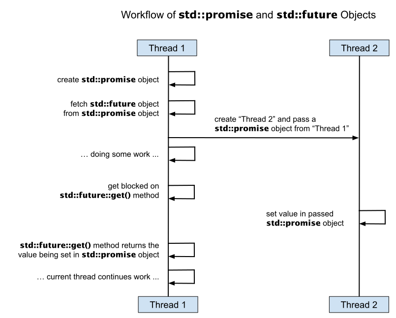
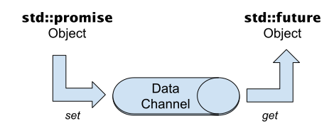

# Futures und Promises

[Zurück](../../Readme.md)

---

Das nachfolgende Diagramm skizziert den Ablauf eines Multithreading-Szenarios 
mit `Future`- und `Promise`-Objekt:

Abbildung 1: Workflow von `std::promise` und `std::future` Objekt.

Man beachte, dass zwischen den beiden Objekten des Typs `Future` und `Promise` ein Datenkanal eingerichtet wird.
Die Thread-Prozedur erhält zum Ausführungszeitpunkt einen `std::promise<>`-Zeiger / eine `std::promise<>`-Referenz übergeben.
Daran können mit Hilfe der `set_value`-Methode Resultate vom Thread zum Thread-Erzeuger transferiert werden.

Abbildung 2: Datenkanal zwischen `std::promise` und `std::future` Objekt.

---

[Zurück](../../Readme.md)

---
