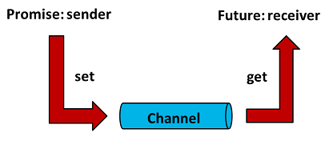

# Future

Das nachfolgende Diagramm skizziert den Ablauf eines Multithreading-Szenarios 
mit `Future`- und `Promise`-Objekt:

Man beachte, dass zwischen den beiden Objekten des Typs `Future` und `Promise` ein Datenkanal eingerichtet wird.

Die Thread-Prozedur erhält zum Ausführungszeitpunkt einen `std::promise<>`-Zeiger / eine `std::promise<>`-Referenz übergeben.

Daran können mit Hilfe der `set_value`-Methode Resultate vom Thread zum Thread-Erzeuger transferiert werden.

---

[Zurück](../../Readme.md)

---