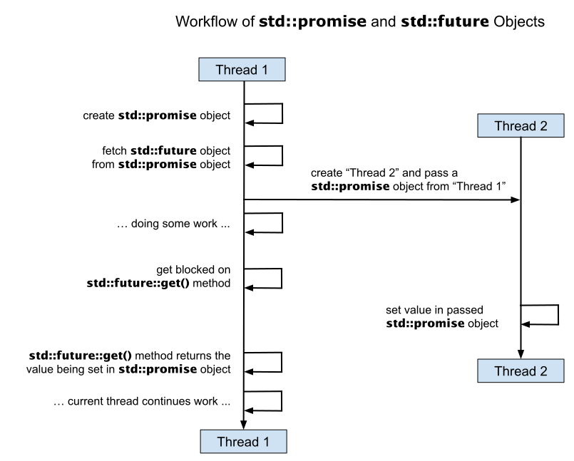
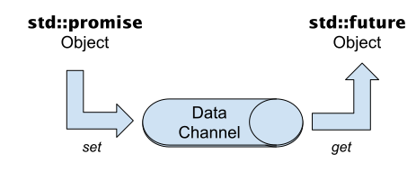

# Klassen `std::future` und `std::promise`

[Zurück](../../Readme.md)

---

## Inhalt

  * [Verwendete Werkzeuge](#link1)
  * [Allgemeines](#link2)
  * [Ein einfaches Beispiel](#link3)
  * [Klasse `std::shared_future<>`](#link4)

---

## Verwendete Werkzeuge 

<ins>Klassen</ins>:

  * Klasse `std::future`
  * Klasse `std::promise`
  * Klasse `std::thread`
  * Klasse `std::jthread`
  * Klasse `std::shared_future`

<ins>Funktionen</ins>:

  * Funktion `std::async`

---

#### Quellcode

[*Future_01.cpp*](Future_01.cpp). 
[*Future_02.cpp*](Future_02.cpp). 
[*Future_03.cpp*](Future_03.cpp).

---

## Allgemeines 

Das nachfolgende Diagramm skizziert den Ablauf eines Multithreading-Szenarios 
mit `std::future`&ndash; und `std::promise`-Objekt:

*Abbildung* 1: Workflow von `std::promise` und `std::future` Objekt.

Man beachte, dass zwischen den beiden Objekten des Typs `Future` und `Promise` ein Datenkanal eingerichtet wird.
Die Thread-Prozedur erhält zum Ausführungszeitpunkt einen `std::promise<>`-Zeiger / eine `std::promise<>`-Referenz übergeben.
Daran können mit Hilfe der `set_value`-Methode Resultate vom Thread zum Thread-Erzeuger transferiert werden.

*Abbildung* 2: Datenkanal zwischen `std::promise` und `std::future` Objekt.

---

## Ein einfaches Beispiel 

Ein einfaches Beispiel skizziert den Ablauf eines Multithreading-Szenarios mit `Future`- und `Promise`-Objekt.

Beachten Sie dabei: Ein `Promise`-Objekt kann nicht *per value* an eine andere Funktion übergeben werden.
Klassische Zeiger oder *RValue*-Referenzen sind ein gangbarer Weg.

---

## Klasse `std::shared_future<>` 

Ein `std::shared_future` Objekt dient dazu, mehrere Threads zurselben Zeit aufzuwecken (*signal*).

Das Beispiel aus dem Repository definiert zwei Lambda-Methoden, die für eine parallele Ausführung gedacht sind.
Am Anfang der jeweiligen Lambda-Methode kommt ein Aufruf von `set_value` zum Einsatz, um dem Haupthread zu signalisieren,
dass die Sekundärthreads mit ihrer Ausführung begonnen haben.

Danach kommt ein Aufruf von `get` zum Zuge, dieser wird an einem `Future`-Objekt ausgeführt.

Bei der Zugriffsklausel der Lambda-Methoden beachte man:

  * Auf das `std::promise<void>` Objekt wird via Referenz zugegriffen.
  * Das `std::shared_future<int>` Objekt wird an das Lambda-Objekt als Kopie übergeben.

---

[Zurück](../../Readme.md)

---
