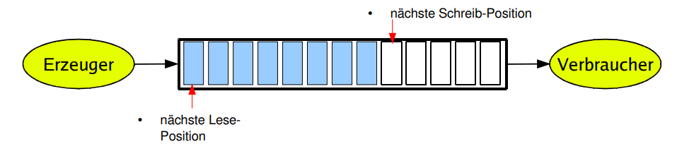

# Das Erzeuger-Verbraucher Problem (*Producer Consumer Pattern*)

[Zurück](../../Readme.md)

---

## Verwendete Werkzeuge

<ins>Klassen</ins>:

  * Klassen `std::mutex`
 
  * Klassen `std::counting_semaphore`
  * Klassen `std::lock_guard`
 
  * Klassen `std::condition_variable`
  * Klassen `std::unique_lock`

---

### Allgemeines

Das Erzeuger-Verbraucher Problem entsteht, wenn ein Erzeuger Daten produziert und diese
irgendwo ablegen muss, bis ein Verbraucher in der Lage ist, diese zu verarbeiten.
Sind keine Daten vorhanden, kann ein Verbraucher nicht arbeiten.

Das Nadelöhr zwischen dem Erzeuger und dem Verbraucher ist ein Puffer.
Dieser stellt das Bindeglied zwischen Erzeuger und Verbraucher dar.

Die Länge eines solchen Puffers kann bei seiner Erzeugung möglicherweise variabel eingestellt werden,
letzten Endes haben wir aber immer die Situation vorliegen,
dass ein solcher Puffer eine begrenzte, maximale Länge besitzt:

*Abbildung* 1: Das *Erzeuger-Verbraucher* Problem

  * Der Erzeuger speichert Informationen in einem längenmäßig begrenzten Puffer.
  * Der Verbraucher liest Informationen aus diesem Puffer.

In der Realisierung steht man nun vor zwei Problemen:

a) Der Puffer ist leer: Wenn der Puffer leer ist, muss der Verbraucher
warten, bis der Erzeuger ein Element im Puffer abgelegt hat.
Erst dann kann der Verbraucher weiter arbeiten.
  
b) Der Puffer ist voll: Wenn der Puffer voll ist, muss der Erzeuger
warten, bis der Verbraucher ein Element aus dem Puffer abgeholt hat.
Erst dann kann der Erzeuger weiter arbeiten.

Da im Regelfall der Erzeuger und der Verbraucher im Kontext unterschiedlicher Threads arbeiten,
benötigen wir zusätzlich die Werkzeuge der nebenläufigen Programmierung.
Desweiteren sollte noch erwähnt werden, dass es sowohl mehrere Erzeuger als auch
mehrere Verbraucher geben kann &ndash; die aber alle gleichzeitig auf einem Puffer operieren.

Für das Erzeuger-Verbraucher Problem gibt es vor diesem Hintergrund betrachtet
mehrere Lösungsansätze:

  * Mit Bedingungsvariablen (`std::counting_semaphore`).
  * Mit Semaphoren (`std::condition_variable`).

In jedem Fall wollen wir vermeiden, dass wir für das Überprüfen eines Pufferzustands (leer, voll)
zuviel Rechenzeit verwenden. Wir differenzieren hier zwischen zwei Ansätzen:

  * Aktives Warten (*Busy Waiting*): Diese Variante des Wartens kann man im Regelfall
in Wiederholungsschleifen beobachten. Eine solche Schleife wird solange ausgeführt,
bis eine Variable einen bestimmten Wert angenommen hat. Dies hat zur Folge,
dass ein Thread aktiv sein muss und die CPU solange belegt, bis die betrachtete Variable
ihren Wert geändert hat.

  * Passives Warten (*Idle Waiting*): In dieser Variante wird ein Thread blockiert (suspendiert)
und wartet auf ein Ereignis,
das ihn wieder in den Zustand &bdquo;bereit&rdquo; versetzt. Der blockierte Thread besitzt keine CPU-Rechenzeit.
Ein anderer Thread muss das Auslösen eines Ereignisses bewirken.
Beim Eintreten des Ereignisses wird der blockierte Thread geweckt.
Zur Umsetzung dieses Ansatzes benötigt man Hilfsmittel des unterlagerten Betriebssystems,
rein mit den  Mitteln gängiger Programmiersprache lässt sich passives Warten nicht realisieren.

Im Quellcode zu diesem Abschnitt finden Sie zwei Realisierungen des 
Erzeuger-Verbraucher Problems vor:

a) Erzeuger-Verbraucher-Problem mit Bedingungsvariablen (`wait` / `notify`).
b) Erzeuger-Verbraucher-Problem mit Semaphoren (`acquire` / `release`).

---

#### Quellcode:

[Erzeuger-Verbraucher-Problem mit Bedingungsvariablen](BlockingQueue.h). 
[Erzeuger-Verbraucher-Problem mit Semaphoren](BlockingQueueEx.h). 

---

## Literaturhinweise

Die Realisierung des Erzeuger-Verbraucher-Problems lehnt sich an den Artikel

[Blocking queue](https://vorbrodt.blog/2019/02/03/blocking-queue/)

aus dem C++ Blog von von Martin Vorbrodt an.

Dieser Artikel demonstriert unter anderem, wie der Puffer über die Technik des *Placement new* 
verwaltet werden kann.

---

[Zurück](../../Readme.md)

---
