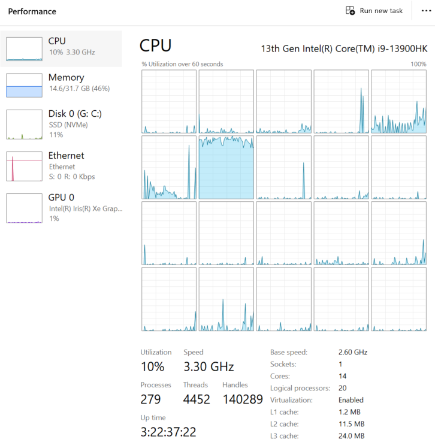

# Realisierung einer Ereigniswarteschlange (*Event Loop* )

[Zurück](../../Readme.md)

---

## Inhalt

  * [Verwendete Werkzeuge](#link1)
  * [Allgemeines](#link2)
  * [Klasse `std::function` oder `std::move_only_function`](#link3)
  * [Konzeption einer `enqueue`-Methode an der Klasse `EventLoop`](#link4)
  * [Funktionen ohne Parameter in der Ereigniswarteschlange](#link5)
  * [Funktionen mit Parametern in der Ereigniswarteschlange](#link6)
  * [`std::invoke` verwenden oder nicht?](#link7)
  * [Doppelpuffertechnik (*Double Buffering*)](#link8)
  * [Beendigung der Ausführung](#link9)
  * [Ein Beispiel: Berechnung von Primzahlen](#link10)
  * [Literaturhinweise](#link11)

---

## Verwendete Werkzeuge <a name="link1"></a>

  * `std::function` und `std::move_only_function`
  * `std::mutex`
  * `std::lock_guard` und `std::unique_lock`
  * `std::condition_variable`
  * `std::jthread`
  * `std::swap`

---

#### Quellcode

[*EventLoop.h*](./EventLoop.h)<br />
[*EventLoop.cpp*](./EventLoop.cpp)<br />
[*TestEventLoop.cpp*](TestEventLoop.cpp)<br />
[*Program.cpp*](Program.cpp)<br />

---

## Allgemeines <a name="link2"></a>

*Kurz gefasst*:

Eine Ereigniswarteschlange (engl. *Event Loop* ) kann man als Alternative zu einem
Mutex-Objekt betrachten. Beide serialisieren Zugriffe auf kritische Abschnitte eines Programms,
jedoch auf unterschiedliche Weise:

  * `std:mutex`-Objekte stellen einen Synchronisationsmechanismus dar, es sind zu diesem Zweck die kritischen Abschnitte
  zu identifizieren und mit entsprechenden `lock` bzw. `unlock`-Aufrufen zu schützen.<br />
  *Bemerkung*: In der Praxis kommen hier entsprechende Hüllenobjekte wie z.B. `std::lock_guard` zum Zuge.
  * Reiht man die kritischen Abschnitte in eine Ereigniswarteschlange ein, kann man auf `std:mutex`-Objekte verzichten.
  Die kritischen Abschnitte müssen zu diesem Zweck aber Funktions-(Methoden-)grenzen haben,
  um sie in eine Ereigniswarteschlange einschleusen zu können.

Generell können die Gründe für den Einsatz dieser Synchronisationsmechanismen unterschiedlicher Natur sein:

  * Möglicherweise wurden die Klassen von einem alten Teil eines Softwaresystems geerbt.
  * Sie entwerfen gerade neue Klassen, möchten diese aber nicht gleich mit
Synchronisationsmechanismen wie `std:mutex`-Objekten überfrachten.

Wir stellen in diesem Abschnitt die Realisierung einer Klasse `EventLoop`,
die eine Ereigniswarteschlange darstellt. Es ist möglich, Funktionen ohne als auch mit Parametern 
in dieser Warteschlange einzureihen. Konzeptionell beabsichtigt hingegen ist der Rückgabetyp `void` bei allen Funktionen.
Welchen Sinn sollte es ergeben, zu einem späteren Zeitpunkte einer Funktionsausführung ein Ergebnis zu erhalten?
Meiner Meinung nach keinen, deshalb dieser Ansatz.

Es folgen einige Hinweise zur Realisierung.


## Klasse `std::function` oder `std::move_only_function` <a name="link3"></a>

Um eine Ereigniswarteschlange zu realisieren, benötigt man die Möglichkeit,
&bdquo;Methodenaufrufe&rdquo; zwischenspeichern zu können. Gewisse Ähnlichkeiten zum *Command Pattern*
aus dem Umfeld der *Design Pattern* sind hier vorhanden.

Hier kommen zwei Klassen ins Spiel: `std::function` oder `std::move_only_function`.
Was ist der Unterschied zwischen diesen beiden Klassen?

| `std::function<void()>` | `std::move_only_function<void()>` |
|:-|:-|
| Kopierbar. | Nur verschiebbar. | 
| Erfordert, dass die gespeicherte Funktion kopierbar ist (es dürfen in der Funktion z. B. keine `std::unique_ptr`-Variablen verwendet werden). | Kann nur verschiebbare Funktionen speichern (z. B. sind `std::unique_ptr`- oder `std::packaged_task`-Objekte erlaubt). | 
| Kann Speicher auf der Halde anlegen. | Vermeidet unnötige Kopien.| 
| Flexibler, aber ressourcenintensiver.| Bessere semantische Eignung für einmalige Aufgaben. | 

*Tabelle* 1: Unterschiede zwischen `std::function<void()>` und `std::move_only_function<void()>`.

Welche Situation liegt bei uns im Kontext der Realisierung einer Ereigniswarteschlange vor?
Alle Ereignisse

  * werden einmalig ausgeführt. 
  * sind sinnvollerweise nicht zu kopieren.
  * werden konzeptionell &bdquo;verarbeitet&rdquo;, sie müssen nicht aufgehoben werden.

Dies entspricht perfekt der *Move-Only*-Semantik.
Damit sollten wir in der Realisierung auf die `std::move_only_function<void()>`-Klasse zurückgreifen:

```cpp
using Event = std::move_only_function<void()>;
```

Betrachten Sie ein Beispiel zur Klasse `std::move_only_function<>`.
Gehen Sie das Beispiel Schritt für Schritt im Debugger durch.
Beobachten Sie dabei, wie das `std::unique_ptr<int>`-Objekt Anweisung für Anweisung
im Programm verschoben wird:

```cpp
01: void test()
02: {
03:     std::unique_ptr<int> ptr{ std::make_unique<int>(123) };
04: 
05:     auto moveOnlyLambda{ [capturedPtr = std::move(ptr)] () -> void {
06:             std::println("Value inside Lambda: {}", *capturedPtr);
07:         }
08:     };
09: 
10:     // moveOnlyLambda is a callable that can only be moved
11:     std::move_only_function<void()> func{ std::move(moveOnlyLambda) };
12: 
13:     func(); // prints "Value inside Lambda: 123"
14: }
```

## Konzeption einer `enqueue`-Methode an der Klasse `EventLoop` <a name="link4"></a>

Die bewährte, idiomatische Vorgehensweise in Modern C++ lautet: *Pass-by-Value*.

```cpp
void enqueue(Event callable);  // Pass by Value
```

Was ist an dieser Lösung so gut?

  * Funktioniert effizient mit RValues:

```cpp
eventLoop.enqueue([] () { /* ... */ });  // Works ! Lambda is first moved into the parameter, 
                                         // then into the std::vector
```


  * Funktioniert mit *LValues* (allerdings ist explizites Verschieben erforderlich)

```cpp
Event event = [] { /* ... */ };
eventLoop.enqueue(std::move(event));   // Works ! Clear Intent
```

Da `std::move_only_function`-Objekte nicht kopiert werden können,
müssen Benutzer beim Übergeben eines vorhandenen Objekts an diese Funktion explizit `std::move()` aufrufen.

Wie sieht es aus, wenn an die Ereignisfunktion Parameter übergeben werden sollen?

```
template<typename TFunc, typename ... TArgs>
void enqueueTask(...);
```

Dies ist äußerst praktisch, da es dem Benutzer erspart,
beim Binden von Argumenten an eine Funktion Lambda-Ausdrücke mit Standard-Boilerplate-Code schreiben zu müssen.
Dieser Boilerplate-Code ist innerhalb der `enqueueTask`-Methode vorhanden.

*Zusammenfassung*:<br />
  * Einfache und sichere Schnittstelle
  * Keine Überladungen
  * Entspricht modernen C++-Konventionen


## Funktionen ohne Parameter in der Ereigniswarteschlange <a name="link5"></a>

Eine Realisierung der `enqueue`-Methode sieht so aus:

```cpp
01: void EventLoop::enqueue(Event callable)
02: {
03:     {
04:         std::lock_guard<std::mutex> guard{ m_mutex };
05: 
06:         m_events.push_back(std::move(callable));
07:     }
08: 
09:     m_condition.notify_one();
10: }
```

In der Realisierung wird RAII für das Thread-Sicherheits-Locking eingesetzt
und das Callable effizient in den Vektor verschoben,
bevor die Methode den wartenden Worker-Thread benachrichtigt.


## Funktionen mit Parametern in der Ereigniswarteschlange <a name="link6"></a>

Welche Funktionen (Rückgabetyp, Parameter) lassen sich in der Ereigniswarteschlange einreihen?
Es sind dies Funktionen mit beliebig vielen Parametern und auch einem beliebigen Rückgabetyp &ndash; und dies sogar,
ohne an der vorhandenen Realisierung der Klasse `EventLoop` Änderungen vornehmen zu müssen.

  * Wie könnte dieser Trick aussehen?
  * Wie werden die Parameter zwischengespeichert?

Wir greifen auf das C++&ndash;Sprachfeature von Lambda-Objekten zurück.
Lambda-Objekte können über die *Capture Clause* auf Variablen der Umgebung zugreifen
und diese mittels `[=]` in das Lambda-Objekt kopieren!

Ab C++ 14 kann man sogar auf das unnötige Kopieren der Parameter verzichten,
mit dem so genannten &bdquo;*Generalized Lambda Capture*&rdquo; Feature können die Parameter auch verschoben werden,
also kann die Move-Semantik Anwendung finden!

Der realisierende Quellcode mag nicht ganz einfach zu lesen zu sein, da er mit Hilfe *variadischer Templates*
eine beliebige Anzahl von Parametern unterschiedlichen Datentyps in das Lambda-Objekt aufnimmt:

```cpp
01: template<typename TFunc, typename ... TArgs>
02: void enqueueTask(TFunc&& func, TArgs&& ...args)
03: {
04:     Logger::log(std::cout, "enqueueTask ...");
05: 
06:     // using "Generalized Lambda Capture" to preserve move semantics
07:     auto callable{
08:         [func = std::forward<TFunc>(func),
09:         ... capturedArgs = std::forward<TArgs>(args)]() mutable -> void {
10:             std::invoke(std::move(func), std::move(capturedArgs)...);
11:         } 
12:     };
13: 
14:     {
15:         // RAII guard
16:         std::lock_guard<std::mutex> guard{ m_mutex };
17:         m_events.push_back(std::move(callable));
18:     }
19: 
20:     m_condition.notify_one();
21: }
```

In Zeile 8 des Listings finden wir einen Lambda-Ausdruck vor:
Der Aufruf der Nachricht `func` ist im Rumpf der Lambda-Funktion platziert &ndash; mit `std::invoke`,
das Funktionsobjekt selbst (`func`) wird via `[func = std::forward<TFunc>(func)]` in das Lambda-Objekt verschoben!
Dies gilt genauso für die Parameter der Funktion, nur kommt hier syntaktisch gesehen das so genannte *Variadic Capture* Sprachfeature hinzu:

```cpp
[... args = std::forward<TArgs>(args)]
```

Eine weitere *Subtilität*:<br />
Warum ist die Lambda-Funktion mit dem Schlüsselwort `mutable` ausgezeichnet?

Wird die Lambda-Funktion nicht als `mutable` markiert, wird der dazugehörige Aufrufoperator zu

```cpp
void operator() () const;
```

übersetzt, was bedeutet, dass `func` innerhalb des Rumpfes effektiv `const` ist.
Dies verhindert üblicherweise das Verschieben von Funktionen.

Erst durch den Gebrauch von `mutable` werden Verschiebungen wirksam.


## `std::invoke` verwenden oder nicht? <a name="link7"></a> 

Man könnte die Zeile 10 aus dem letzten Listing

```cpp
std::invoke(std::move(func), std::move(capturedArgs) ...);
```

auch kürzer so schreiben:

```cpp
func(std::move(capturedArgs) ...);
```

oder, wenn man `func` verschieben möchte:

```cpp
std::move(func) (std::move(capturedArgs) ...);
```

Dennoch sind diese beiden Varianten nicht ganz identisch!
Die Verwendung von `std::invoke` bietet hier einen Vorteil bezüglich der Flexibilität der Nachrichtenwarteschlange,
wenn man Methoden von Objekten einreihen möchte.

Der direkte Aufruf `func(...)` funktioniert nur bei &bdquo;echten&rdquo; Funktionen.
Dazu zählen reguläre (&bdquo;freie&rdquo;) Funktionen, Funktionszeiger, Lambdas und aufrufbare Objekte
(Klassen, die den `operator()` überladen).

Der Gebrauch von `std::invoke()` akzeptiert zusätzlich zu den oben genannten Typen auch Zeiger auf Elementfunktionen (Member-Funktionen)
und Zeiger auf Datenelemente von Klassen.

Ein Beispiel:

```cpp
01: struct MyClass
02: {
03:     void doSomeWork (int x) { Logger::log(std::cout, "... doing some work ..."); }
04: };
05: 
06: void test()
07: {
08:     EventLoop loop{};
09: 
10:     MyClass obj;
11:     loop.enqueueTask(&MyClass::doSomeWork, &obj, 123);
12: 
13:     loop.start();
14:     loop.stop();
15: }
```

Dieses Beispiel ist übersetzungs- und lauffähig, wenn man in der `enqueueTask`-Methode die `std::invoke`-Funktion verwendet.
Im anderen Fall kommt es zu einem Übersetzungsfehler.


## Doppelpuffertechnik (*Double Buffering*) <a name="link8"></a>

In der Realisierung der Abarbeitung der Nachrichten
finden Sie eine Umsetzung der *Double Buffering Technik* vor.

Es kommen zwei Objekte des Typs `std::vector<std::move_only_function<void()>>` zum Einsatz:

  * Der erste Puffer dient ausschließlich zum Einreihen neuer Nachrichten.
  * Der zweite Puffer dient ausschließlich zum Entnehmen vorhandener Nachrichten.

Das Tauschen der Puffer findet innerhalb einer Mutex-Sperre statt, mit der Funktion `std::swap` werden
die beiden Pufferinhalte möglichst effizient getauscht.

Nach einem Tausch ist der erste Puffer grundsätzlich leer, der zweite Puffer hat den Inhalt des ersten Puffers erhalten
und kann nun bei Bedarf bzw. wenn Rechenzeit vorhanden ist, abgearbeitet werden.

Eine grobe Skizzierung der Realisierung der Verarbeitung der Nachrichten in der Warteschlange
&ndash; inklusive Doppelpuffertechnik &ndash; sieht so aus:

```cpp
01: void event_loop()
02: {
03:     std::vector<std::move_only_function<void()>> events;
04: 
05:     while (true)
06:     {
07:         {
08:             std::unique_lock<std::mutex> guard{ m_mutex };
09: 
10:             m_condition.wait(
11:                 guard,
12:                 [this] () -> bool { return ! m_events.empty() || !m_running; }
13:             );
14: 
15:             if (!m_running && m_events.empty())
16:                 return;
17: 
18:             std::swap(events, m_events);
19:         }
20: 
21:         for (auto& callable : events)
22:         {
23:             callable();
24:         }
25: 
26:         events.clear();  // empty container for next loop
27:     }
28: }
```

In Zeile 10 finden wir einen Aufruf der `wait`-Methode an einem `m_condition`-Objekt vor.
Hierzu muss es einen korrespondierenden `notify_one`- oder `notify_all`-Aufruf geben:

```cpp
01: void enqueue(std::move_only_function<void()> callable)
02: {
03:     {
04:         std::lock_guard<std::mutex> guard{ m_mutex };
05:         m_events.push_back(std::move(callable));
06:     }
07: 
08:     m_condition.notify_one();
09: }

```

Sinnigerweise ist dieser Aufruf in der Methode `enqueue` vorhanden, wenn neue Nachrichten in der
Warteschlange aufgenommen werden.

## Beendigung der Ausführung <a name="link9"></a>

Wenn die Abarbeitung der Nachrichten beendet werden soll,
wird dies dadurch erreicht, dass eine spezielle Nachricht in die Warteschlange am Ende eingefügt wird:

```cpp
[this] { m_running = false; }
```

Mit diesem Lambda-Ausdruck wird einfach das Flag `m_running` umgesetzt,
und so die Ausführung der Verarbeitungsprozedur verlassen.

---

## Ein Beispiel: Berechnung von Primzahlen <a name="link10"></a>

Ein Beispiel zur sequentiellen Berechnung von Primzahlen könnte so aussehen:

```cpp
01: void test()
02: {
03:     Logger::log(std::cout, "Start");
04: 
05:     std::size_t foundPrimeNumbers{};
06: 
07:     EventLoop eventLoop;
08: 
09:     Logger::log(std::cout, "Enqueuing tasks ...");
10: 
11:     for (std::size_t i{ PrimeNumberLimits::Start }; i < PrimeNumberLimits::End; i += 2) {
12: 
13:         eventLoop.enqueueTask(
14:             [&] (std::size_t value) {
15: 
16:                 bool primeFound{ PrimeNumbers::IsPrime(value) };
17: 
18:                 if (primeFound) {
19:                     Logger::log(std::cout, "> ", value, " is prime.");
20: 
21:                     ++foundPrimeNumbers;
22:                 }
23:             },
24:             i
25:         );
26:     }
27: 
28:     Logger::log(std::cout, "Enqueuing tasks done.");
29:     Logger::log(std::cout, "Starting Event Loop:");
30: 
31:     eventLoop.start();
32:     eventLoop.stop();
33: 
34:     Logger::log(std::cout, "Found ", foundPrimeNumbers, " prime numbers between ",
35:         PrimeNumberLimits::Start, " and ", PrimeNumberLimits::End, '.'
36:     );
37: }
```

*Ausgabe*:

```
[1]:    Start
[1]:    Enqueuing tasks ...
[1]:    enqueueTask ...
............
[1]:    enqueueTask ...
[1]:    enqueueTask ...
[1]:    Enqueuing tasks done.
[1]:    Starting Event Loop:
[2]:    > Event Loop
[2]:    swapped 51 event(s) ...
[2]:    ! invoking next event
[2]:    ! invoking next event
[2]:    > 1000000000000000003 is prime.
[2]:    ! invoking next event
[2]:    ! invoking next event
[2]:    ! invoking next event
[2]:    > 1000000000000000009 is prime.
[2]:    ! invoking next event
[2]:    ! invoking next event
[2]:    ! invoking next event
............
[2]:    ! invoking next event
[2]:    ! invoking next event
[2]:    > 1000000000000000031 is prime.
[2]:    ! invoking next event
[2]:    ! invoking next event
[2]:    ! invoking next event
[2]:    ! invoking next event
[2]:    ! invoking next event
[2]:    ! invoking next event
............
[2]:    ! invoking next event
[2]:    ! invoking next event
[2]:    ! invoking next event
[2]:    ! invoking next event
[2]:    ! invoking next event
[2]:    > 1000000000000000079 is prime.
[2]:    ! invoking next event
[2]:    ! invoking next event
[2]:    ! invoking next event
............
[2]:    ! invoking next event
[2]:    ! invoking next event
[2]:    ! invoking next event
[2]:    < Event Loop
[1]:    Found 4 prime numbers between 1000000000000000001 and 1000000000000000101.
[1]:    Done.
[1]:    Elapsed time: 4642 [milliseconds]
```

Der Blick auf den Task Manager lässt erkennen, dass ein Kern sehr stark
und ein zweiter Kern etwas weniger an der Ausführung des Programms beteiligt sind:



---

## Literaturhinweise <a name="link11"></a>

Die Anregungen zur Klasse `EventLoop` stammen im Wesentlichen aus dem Artikel

[Idiomatic Event Loop in C++](https://habr.com/en/articles/665730/)

von *Anton Vasin*.

---

[Zurück](../../Readme.md)

---
