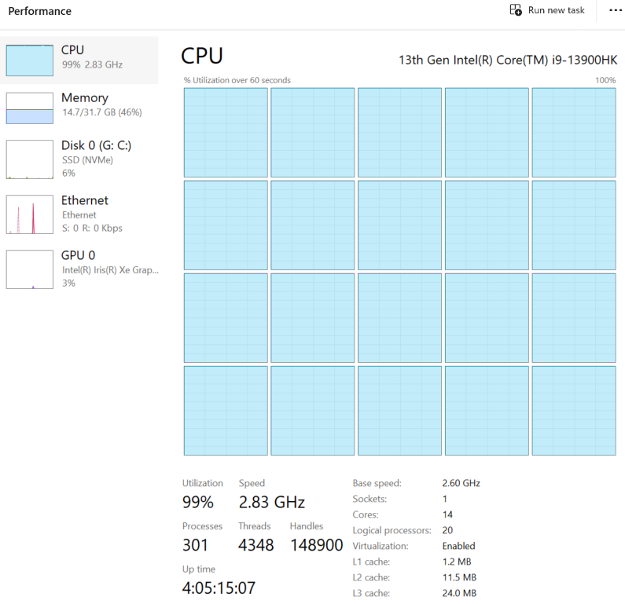
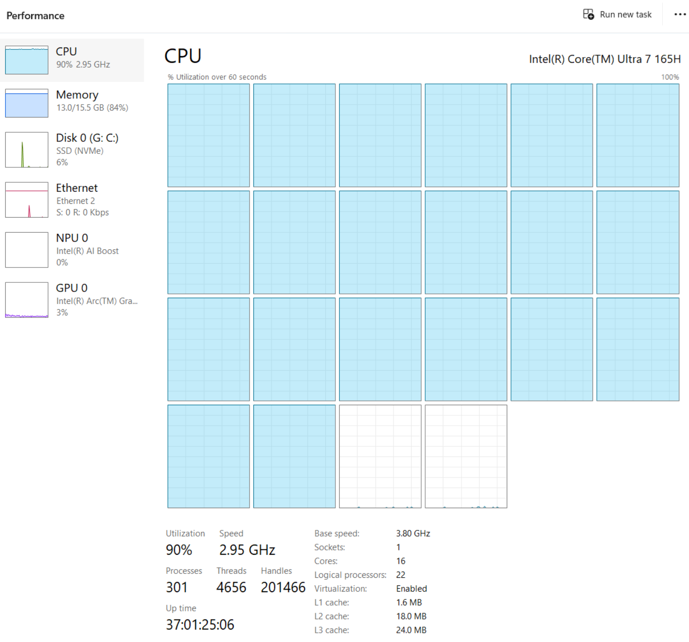

# Realisierung eines Thread Pools

[Zurück](../../Readme.md)

---

## Verwendete Werkzeuge

<ins>Klassen</ins>:

  * Klasse `std::mutex`
  * Klasse `std::lock_guard`
  * Klasse `std::unique_lock`
  * Klasse `std::condition_variable`
  * Klasse `std::future`
  * Klasse `std::packaged_task`
  * Klasse `std::thread`
  * Klasse `std::queue`
  * Klasse `std::move_only_function`


<ins>Funktionen</ins>:

  * Funktion `std::thread::hardware_concurrency`

---

## Allgemeines

Ein *Thread Pool* ermöglicht es, Threads wiederzuverwenden.
Auf diese Weise wird verhindert, dass zur Laufzeit neue Threads erstellt werden müssen.
Das Erstellen neuer Threads ist zeit- und ressourcenintensiv. 

In der einschlägigen Literatur oder im Netz findet man mehrere Realisierungen für Thread Pools vor:

  * Buch von Anthony Williams: &bdquo;*Concurrency in Action* &ndash; *2nd Edition*&rdquo;,<br />Kapitel 9: &bdquo;Thread Pools&rdquo;.

  * Buch von  Arthur O'Dwyer: &bdquo;*Mastering the C++17 STL*&rdquo;,<br />Kapitel 7: &bdquo;Building your own thread pool&rdquo;.
  
  * Zwei Artikel von Martin Vorbrodt: &bdquo;*Vorbrodt's C++ Blog*&rdquo; &ndash;<br />&bdquo;[Simple thread pool](https://vorbrodt.blog/2019/02/27/advanced-thread-pool/)&rdquo; und &bdquo;[Advanced thread pool](https://vorbrodt.blog/2019/02/12/simple-thread-pool/)&rdquo;.

Wir stellen in diesem Projekt eine Überarbeitung einer Thread Pool Realisierung von Zen Sepiol vor,
die in Youtube verfügbar ist:<br />
[How to write Thread Pools in C++](https://www.youtube.com/watch?v=6re5U82KwbY)
und
[How C++23 made my Thread Pool twice as fast](https://www.youtube.com/watch?v=meiGRnyRBXM&t=1s),
[Sources siehe hier](https://github.com/ZenSepiol/Dear-ImGui-App-Framework/blob/main/src/lib/thread_pool/thread_pool_test.cpp).

---

## Einige Details in der Thread Pool Realisierung

In der vorliegenden Realisierung besteht der Thread Pool aus zwei Warteschlangen:

  * eine Warteschlange für Worker Threads.
  * eine Warteschlange für *Tasks* bzw. *Callables* (auszuführenden Funktionen).

Für die Warteschlange der Worker Threads greifen wir auf den STL-Container `std::vector` zurück:

```cpp
std::vector<std::thread> m_pool;
```

Typischerweise wird die Größe dieses Containers, also die Anzahl der zur Verfügung stehenden Worker-Threads,
von der Funktion `std::thread::hardware_concurrency()` beeinflusst.


Nun kommen wir auf die zweite Warteschlange mit den *Callables* (auszuführende Funktionen) zu sprechen.
Steht eine Aufgabe (*Task*) zur Ausführung an, gibt es im Thread Pool eine Methode (hier: `addTask`),
die die dazugehörige Funktion (*Callable*) in die Warteschlange aller noch ausstehenden Tasks am Ende hinzufügt.

Wie legen wir den Datentyp für eine solche *Task* fest?
Ein sehr einfacher Ansatz würde hierzu *Callables* mit einer festen Signatur festlegen,
zum Beispiel Funktionen ohne Parameter und mit Rückgabetyp `void`. Derartige Funktionen könnte man dann
mit der *Universal Function* Wrapperklasse `std::function` als Variablen in einem Programm hantieren:

```cpp
std::function<void()> func;
```

`std::function<>`-Objekte sind kopierbar.
Dies kann in der täglichen Arbeit jedoch hinderlich sein
(z. B. wenn in den gekapselten Funktionen `std::unique_ptr`-Objekte zum Einsatz kommen),
deshalb wurde mit C++ 23 der Typ `std::move_only_function` eingeführt.
Objekte dieses Typs sind, wie der Name sagt, nur verschiebbar (&bdquo;*move-only*&rdquo;)
und können daher auch nicht-kopierbare Funktionsobjekte speichern.

Damit sollten wir unsere Funktionen in Variablen des Typs 

```cpp
std::move_only_function<void()> func;
```

abspeichern. Die Warteschlange für die *Tasks* könnte damit so definiert werden:

```cpp
std::queue<std::move_only_function<void()>> m_queue;
```

Unser Anspruch an *Tasks* besteht allerdings darin, Funktionen mit beliebigen Signaturen als Threadprozeduren verwalten zu können.
Dazu müssen wir zunächst einmal eine &bdquo;flexible&rdquo; `addTask`-Methode definieren.
Die Flexibilität gewinnen wir mit variadischen Parametern:

```cpp
template <typename TFunc, typename... TArgs>
auto addTask(TFunc&& func, TArgs&&... args)
    -> std::future<typename std::invoke_result<TFunc, TArgs...>::type>
{
    ...
}
```

Der Parameter `func` nimmt ein *Callable* entgegen, die Parameter zum Aufruf dieses  *Callables* wiederum
folgen in einer variablen Anzahl von Parametern, die als *Parameter Pack* `args` beschrieben werden. 

Wie lassen sich die Werte dieser Parameter in einem Hüllenobjekt zwischenspeichern?
Dazu bietet sich ein Lambda-Objekt an, das die Parameter über den *Closure* in das Lambda-Objekt kopiert.

Jetzt haben wir aber nicht eine feste Anzahl von Parametern, sondern variabel viele.
An dieser Stelle kommt eine &bdquo;*variadische Capture Clause*&rdquo; ins Spiel,
also syntaktisch gesehen ein Ausdruck der Gestalt

```cpp
[...args = std::forward<Args>(args)]
```

Damit werden das *Callable* und die Parameter durch einen Aufruf von `addTask`
wie folgt in einem Hüllenobjekt abgelegt:

```cpp
template <typename TFunc, typename... TArgs>
auto addTask(TFunc&& func, TArgs&&... args)
    -> std::future<typename std::invoke_result<TFunc, TArgs...>::type>
{
    using ReturnType = std::invoke_result<TFunc, TArgs...>::type;

    auto task = std::packaged_task<ReturnType()>{
        [func = std::forward<TFunc>(func),
        ... args = std::forward<TArgs>(args)]() mutable -> ReturnType
        {
            return std::invoke(std::move(func), std::move(args) ...);
        }
    };

    ...
}
```

Mit dem so genannten &bdquo;*Generalized Lambda Capture*&rdquo; kann die Move-Semantik
beim Transport der Daten in das Lambda-Objekt Anwendung finden, zum Beispiel so:

```cpp
[func = std::forward<TFunc>(func),
...
```

Der Ergebnistyp des Hüllenobjekts ließe sich vom Compiler mit *Automatic Type Deduction* herleiten,
zu Demonstrationszwecken können wir ihn auch explizit hinschreiben:

```cpp
std::invoke_result<TFunc, TArgs...>::type
```

oder noch kürzer als

```cpp
std::invoke_result_t<TFunc, TArgs...>
```

Hier kommt das Template `std::invoke_result_t` zum Zuge, das genau für diesen Verwendungszweck in der STL vorhanden ist.


Wozu legen wir eigentlich ein `std::packaged_task`-Objekt an?
Für den von mir gewählten Lösungsansatz will ich Ergebnisse von den Thread-Prozeduren zurückerhalten,
sprich wir benötigen pro asynchroner Funktionsausführung ein `std::future`-Objekt.
Dieses erhalten wir wiederum von einem `std::packaged_task`-Objekt mit der Methode `get_future`:

```cpp
auto task = std::packaged_task<ReturnType()>{
    ...
};

auto future{ task.get_future() };
```

Noch sind wir nicht am Ziel:
Wir müssen die *Task*-Objekte in einer Warteschlange ablegen:

```cpp
std::queue<std::move_only_function<void()>> m_queue;
```

Der Hüllentyp `std::move_only_function<>` ist der Typ schlechthin, um *Callable*-Objekte performant verschieben zu können.
Nur ist die Schnittstelle `void()>` wieder etwas &bdquo;eng gefasst&rdquo;, wir wollten doch Threadprozeduren 
mit variabler Anzahl von Parametern unterschiedlichen Datentyps verwalten können.

Okay, auf eine Hülle mehr oder weniger kommt es jetzt auch nicht mehr an:

```cpp
auto wrapper{ [task = std::move(task)] () mutable -> void { task(); } };
```

Ja, Sie haben es richtig gesehen: Mit dem Lambda aus dem letzten Code-Snippet definieren wir ein *Callable*,
dass die Signatur `void()` hat! 
Dieses Hüllenobjekt können wir nun in unsere Warteschlange für Threadprozeduren einreihen:

```cpp
m_queue.push(std::move(wrapper));
```

Damit haben wir die zentralen Stellen der Methode `addTask` der `ThreadPool`Klasse betrachtet,
ein zugegebenermaßen nicht ganz leichtes Unterfangen.
Die Methode im Ganzen sieht so aus:

```cpp
01: template <typename TFunc, typename... TArgs>
02: auto addTask(TFunc&& func, TArgs&&... args)
03:     -> std::future<typename std::invoke_result<TFunc, TArgs...>::type>
04: {
05:     using ReturnType = std::invoke_result<TFunc, TArgs...>::type;
06: 
07:     auto task = std::packaged_task<ReturnType()>{
08:         [func = std::forward<TFunc>(func),
09:         ... args = std::forward<TArgs>(args)]() mutable -> ReturnType
10:         {
11:             return std::invoke(std::move(func), std::move(args) ...);
12:         }
13:     };
14: 
15:     auto future{ task.get_future() };
16: 
17:     // generalized lambda capture
18:     auto wrapper{ [task = std::move(task)]() mutable -> void { task(); } };
19: 
20:     {
21:         std::lock_guard<std::mutex> guard{ m_mutex };
22:         m_queue.push(std::move(wrapper));
23:     }
24: 
25:     // wake up one waiting thread if any
26:     m_condition.notify_one();
27: 
28:     // return future from packaged_task
29:     return future;
30: }
```

Jetzt vollziehen wir einen Wechsel von der Warteschlange der Threadprozeduren zur Warteschlange der Workerthreads.
Jeder Worker Thread entnimmt, wenn er nichts zu tun hat, eine Task vom Anfang der Warteschlange der *Tasks* und führt die hierin gekapselte Funktion aus.
Nach der Ausführung der Funktion entnimmt der Worker Thread die nächste Task aus der Warteschlange
oder er begibt sich in einen *Idle*-Zustand, wenn die Warteschlange mit den *Tasks* leer ist.

Die Betrachtungen zur Warteschlange der Workerthreads fassen wir hier etwas kürzer,
da der Quellcode nicht so komplex geraten ist:

```cpp
01: void ThreadPool::worker()
02: {
03:     std::unique_lock<std::mutex> guard{ m_mutex };
04: 
05:     while (!m_shutdown_requested || (m_shutdown_requested && !m_queue.empty()))
06:     {
07:         m_busy_threads--;
08: 
09:         m_condition.wait(guard, [this] {
10:             return m_shutdown_requested || !m_queue.empty();
11:         });
12: 
13:         m_busy_threads++;
14: 
15:         if (!this->m_queue.empty())
16:         {
17:             auto func{ std::move(m_queue.front()) };
18:             m_queue.pop();
19: 
20:             guard.unlock();
21: 
22:             func();
23: 
24:             guard.lock();
25:         }
26:     }
27: }
```

Um es noch einmal zusammenzufassen: Für Funktionen, die wird als Threadprozeduren verwenden wollen,
benötigen wir zwei Hüllenobjekte, um diese in einem `std::queue`-Objekt ablegen zu können:

  * Ein erstes Lambda-Objekt, das die Funktion `func` und deren Parameter `args` kapselt.
  * Ein zweites Lambda-Objekt, das das `std::packaged_task`-Objekt kapselt.


Dies ist im Grunde genommen das minimale Design, wenn wir ein `std::future`-Objekt zurückgeben wollen (Notwendigkeit eines `std::packaged_task`-Objekts).

Das zweite Lambda-Objekt ist auch aus einem anderen Grund unumgänglich:
Da unsere Warteschlange für *Tasks* die Definition

```cpp
std::queue<std::move_only_function<void()>> m_queue;
```

besitzt, müssen wir Funktionen mit einer anderen Schnittstellen adäquat umschließen.
`std::packaged_task<ReturnType(...TArgs)>`-Objekte sind nicht implizit in `std::packaged_task<void()>`-Objekte konvertierbar.

Dennoch gibt es einen anderen modernen Ansatz für Thread-Pools, der ohne `std::packaged_task`-Objekt auskommt
trotzdem `std::future`-Objekte zurückgibt. Für diesen Ansatz schreiben wir eine zweite Methode `addTaskEx`.

---

### Ein zweiter Ansatz in der Realisierung der `addTask`-Methode


In diesem Ansatz tauschen wir den Datentyp `std::packaged_task` durch den Datentyp `std::promise` aus,
ein simpler, aber wirkungsvoller Trick.
Auf Grund der bisherigen Vorbereitungen können wir den Quellcode der überarbeiteten `addTask`-Methode (`addTaskEx`) gleich direkt anschauen:

```cpp
01: template <typename TFunc, typename... TArgs>
02: auto addTaskEx(TFunc&& func, TArgs&&... args)
03:     -> std::future<typename std::invoke_result<TFunc, TArgs...>::type>
04: {
05:     using ReturnType = std::invoke_result<TFunc, TArgs...>::type;
06: 
07:     std::shared_ptr<std::promise<ReturnType>> promise{
08:         std::make_shared<std::promise<ReturnType>>() 
09:     };
10: 
11:     std::future<ReturnType> future{ promise->get_future() };
12: 
13:     m_queue.push(
14:         [promise,
15:         func = std::forward<TFunc>(func),
16:         ... args = std::forward<TArgs>(args)] () mutable
17:         {
18:             try
19:             {
20:                 if constexpr (std::is_void_v<ReturnType>)
21:                 {
22:                     std::invoke(std::move(func), std::move(args)...);
23:                     promise->set_value();
24:                 }
25:                 else
26:                 {
27:                     auto result{ std::invoke(std::move(func), std::move(args)...) };
28:                     promise->set_value(std::move(result));
29:                 }
30:             }
31:             catch (...)
32:             {
33:                 promise->set_exception(std::current_exception());
34:             }
35:         }
36:     );
37: 
38:     return future;
39: }
```

Ja, in der Tat haben wir nun nur noch ein Lambda-Objekt (siehe Zeile 14 ff.).
Die Version ist außerdem &bdquo;Exception-safe&rdquo;,
es werden Ausnahmen korrekt weitergeleitet:

```cpp
promise->set_exception(std::current_exception());
```

*Bemerkung*:
Die &bdquo;Exception-Safety&rdquo; hat aber für die ursprüngliche Version mit der Klasse `std::packaged_task` ebenfalls gegolten,
da `std::future`-Objekte ebenfalls Ausnahmen transportieren bzw. werfen, wenn diese eintreten.


Wenn es der Beobachtung einer Einschränkung bedarf, dann wäre es die Zeilen

```cpp
std::shared_ptr<std::promise<ReturnType>> promise{
    std::make_shared<std::promise<ReturnType>>() 
};
```

gewesen. Wir legen das `std::promise<ReturnType>>`-Objekt auf dem Heap an.
Warum? Die in der Warteschlange gespeicherten Lambda-Funktionen müssen sicher kopierbar/verschiebbar sein
und wir wollen keine Lebensdauerprobleme haben.
Man beachte, dass die `std::promise`-Variable des Typs `std::shared_ptr` in das Lambda-Objekt kopiert wird.

---

### Ein erstes Beispiel: Threadpool starten und herunterfahren

Starten und Herunterfahren des Threadpools:

```cpp
01: void test()
02: {
03:     Logger::log(std::cout, "Start");
04:     ThreadPool pool{};
05:     std::this_thread::sleep_for(std::chrono::seconds{ 1 });
06:     pool.start();
07:     std::this_thread::sleep_for(std::chrono::seconds{ 2 });
08:     pool.stop();
09:     Logger::log(std::cout, "Done.");
10: }
```

Ausgabe:

```
[1]:    Start
[1]:    Number of available concurrent threads: 20
[2]:    Started worker [28460]
[3]:    Started worker [8004]
........
[20]:   Started worker [28104]
[21]:   Started worker [14356]
[21]:   Worker Done [14356]
[19]:   Worker Done [26520]
........
[7]:    Worker Done [28636]
[2]:    Worker Done [28460]
[1]:    Done.
```

---

### Ein zweites Beispiel: Fünf einfache Tasks ausführen

Starten des Threadpools, Hinzufügen von fünf Tasks, Herunterfahren des Threadpools:

```cpp
01: void emptyTask()
02: {
03:     Logger::log(std::cout, "Doing nothing :)");
04: }
05: 
06: void test()
07: {
08:     ThreadPool pool{};
09: 
10:     std::queue<std::future<void>> results{};
11: 
12:     for (std::size_t n{}; n != 5; ++n)
13:     {
14:         auto future{ pool.addTask(emptyTask) };
15:         results.push(std::move(future));
16:     }
17: 
18:     pool.start();
19: 
20:     while (results.size())
21:     {
22:         auto& future{ results.front() };
23:         future.get();
24:         results.pop();
25:     }
26: 
27:     pool.stop();
28: 
29:     Logger::log(std::cout, "Done.");
30: }
```

*Ausgabe*:

```
[1]:    Start
[1]:    addTask ...
[1]:    addTask ...
[1]:    addTask ...
[1]:    addTask ...
[1]:    addTask ...
[1]:    Number of available concurrent threads: 20
[2]:    Started worker [28596]
[4]:    Started worker [27532]
[3]:    Started worker [16288]
[2]:    Doing nothing :)
[5]:    Started worker [30460]
[6]:    Started worker [2680]
[7]:    Started worker [2672]
[4]:    Doing nothing :)
[3]:    Doing nothing :)
[13]:   Started worker [22764]
[2]:    Doing nothing :)
[9]:    Started worker [23176]
[5]:    Doing nothing :)
[18]:   Started worker [3720]
[9]:    Worker Done [23176]
[12]:   Started worker [25752]
[20]:   Started worker [27776]
[14]:   Started worker [13332]
[15]:   Started worker [21040]
[16]:   Started worker [20552]
[17]:   Started worker [16072]
[10]:   Started worker [23288]
[11]:   Started worker [7900]
[19]:   Started worker [23212]
[5]:    Worker Done [30460]
[8]:    Started worker [17292]
[2]:    Worker Done [28596]
[21]:   Started worker [28212]
[3]:    Worker Done [16288]
[13]:   Worker Done [22764]
[4]:    Worker Done [27532]
[18]:   Worker Done [3720]
[7]:    Worker Done [2672]
[6]:    Worker Done [2680]
[12]:   Worker Done [25752]
[20]:   Worker Done [27776]
[14]:   Worker Done [13332]
[15]:   Worker Done [21040]
[16]:   Worker Done [20552]
[17]:   Worker Done [16072]
[10]:   Worker Done [23288]
[11]:   Worker Done [7900]
[19]:   Worker Done [23212]
[8]:    Worker Done [17292]
[21]:   Worker Done [28212]
[1]:    Done.
```

---

### Ein drittes Beispiel: Primzahlen berechnen

Dieses Mal ist das Beispiel etwas umfangreicher, wir berechnen Primzahlen.
Für den Nachweis der Primzahleigenschaft wird für jeden Primzahlenkandidaten ein separater Thread des Threadpools herangezogen,
sprich eine entsprechende Task in den Pool eingereiht.

Die Ausgabe weiter unten passt zum Zahlenbereich von 1'000'000'000'000'000'001 bis 1'000'000'000'000'030'001.
Es werden folglich 30'000 Tasks in den Pool eingereiht.
Die Laufzeit dieses Beispiels beträgt in etwas 2 Minuten.
Damit ist es möglich, den Taskmanager bei voller Auslastung des Systems beobachten zu können,
siehe auch *Abbildung* 1 weiter unten.


Im einzelnen werden folgende Tätigkeiten ausgeführt:

  * Starten des Threadpools.
  * Einreihen von 30'000 Tasks.
  * Abspeichern / Zwischenspeichern von 30'000 `std::future`-Objekten.
  * Berechnen des Gesamtsumme aller gefundenen Primzahlen.
  * Ausgabe des Ergebnisses (Anzahl der gefundenen Primzahlen).
  * Herunterfahren des Threadpools.


*Programm*:

```cpp
01: void test()
02: {
03:     ScopedTimer clock{};
04: 
05:     std::size_t foundPrimeNumbers{};
06:     std::queue<std::future<bool>> results;
07:     ThreadPool pool{};
08: 
09:     Logger::log(std::cout, "Enqueuing tasks");
10: 
11:     for (std::size_t i{ PrimeNumberLimits::Start }; i < PrimeNumberLimits::End; i += 2) {
12: 
13:         std::future<bool> future{ pool.addTask(PrimeNumbers::IsPrime, i) };
14:         results.push(std::move(future));
15:     }
16: 
17:     Logger::log(std::cout, "Enqueuing tasks done.");
18: 
19:     pool.start();
20: 
21:     while (results.size() != 0)
22:     {
23:         auto found = results.front().get();
24:         if (found) {
25:             ++foundPrimeNumbers;
26:         }
27: 
28:         results.pop();
29:     }
30: 
31:     Logger::log(std::cout, "Found ", foundPrimeNumbers, " prime numbers between ", 
32:         PrimeNumberLimits::Start, " and ", PrimeNumberLimits::End, '.'
33:     );
34:         
35:     pool.stop();
36: }
```

*Ausgabe*:

```
[1]:    Start
[1]:    Enqueuing tasks
[1]:    Enqueuing tasks done.
[1]:    Number of available concurrent threads: 20
[2]:    Started worker [24304]
[3]:    Started worker [19068]
[4]:    Started worker [25344]
[5]:    Started worker [15260]
[6]:    Started worker [4856]
[7]:    Started worker [18460]
[8]:    Started worker [3616]
[9]:    Started worker [5184]
[10]:   Started worker [6608]
[11]:   Started worker [29624]
[12]:   Started worker [13084]
[13]:   Started worker [296]
[14]:   Started worker [21084]
[15]:   Started worker [16960]
[16]:   Started worker [16224]
[17]:   Started worker [13756]
[18]:   Started worker [25248]
[19]:   Started worker [19296]
[20]:   Started worker [21800]
[21]:   Started worker [22132]
[1]:    Found 724 prime numbers between 1000000000000000001 and 1000000000000030001.
[6]:    Worker Done [4856]
[13]:   Worker Done [296]
[16]:   Worker Done [16224]
[5]:    Worker Done [15260]
[12]:   Worker Done [13084]
[4]:    Worker Done [25344]
[11]:   Worker Done [29624]
[14]:   Worker Done [21084]
[8]:    Worker Done [3616]
[17]:   Worker Done [13756]
[19]:   Worker Done [19296]
[7]:    Worker Done [18460]
[2]:    Worker Done [24304]
[15]:   Worker Done [16960]
[9]:    Worker Done [5184]
[3]:    Worker Done [19068]
[20]:   Worker Done [21800]
[18]:   Worker Done [25248]
[21]:   Worker Done [22132]
[10]:   Worker Done [6608]
[1]:    Done.
[1]:    Elapsed time: 121238 [milliseconds]
```

Wir erkennen am Taskmanager, dass das System mit 99% ziemlich stark ausgelastet ist.



*Abbildung* 1: Task Manager während aktiver Thread Pool Anwendung.

Wenn ich das Programm auf einem zweiten Rechner laufen lasse, dann sieht die Auslastung etwas anders aus:



*Abbildung* 2: Task Manager während aktiver Thread Pool Anwendung auf einem zweiten Rechner.


---

### Ein viertes Beispiel: Primzahlen berechnen und in der Konsole ausgeben

Wir nehmen am letzten Programm einige kleine Änderungen vor:

  * Jede gefundene Primzahl wird in der Konsole ausgegeben.
  * Die Workerthreads des Pools transferieren keine Ergebnisse, d.h. der Rückgabetyp ist `std::future<void>`.

Das Programm sieht nun so aus:

```cpp
01: void test()
02: {
03:     ScopedTimer clock{};
04: 
05:     std::size_t foundPrimeNumbers{};
06:     std::queue<std::future<void>> results;
07:     ThreadPool pool{};
08: 
09:     Logger::log(std::cout, "Enqueuing tasks");
10: 
11:     for (std::size_t i{ PrimeNumberLimits::Start }; i < PrimeNumberLimits::End; i += 2) {
12: 
13:         std::future<void> future{ pool.addTask(
14:             [](std::size_t number) {
15:                 bool found {PrimeNumbers::IsPrime(number)};
16:                 if (found) {
17:                     Logger::log(std::cout, "> ", number, " is prime.");
18:                 }     
19:             }, 
20:             i
21:         )};
22: 
23:         results.push(std::move(future));
24:     }
25: 
26:     Logger::log(std::cout, "Enqueuing tasks done.");
27: 
28:     pool.start();
29: 
30:     Logger::log(std::cout, "Found ", foundPrimeNumbers, " prime numbers between ",
31:         PrimeNumberLimits::Start, " and ", PrimeNumberLimits::End, '.'
32:     );
33: 
34:     pool.stop();
35: }
```

*Ausgabe*:

```
[1]: 	Press any key to start ...
[1]: 	Start
[1]: 	Enqueuing tasks
[1]: 	Enqueuing tasks done.
[1]: 	Number of available concurrent threads: 22
[1]: 	Found 0 prime numbers between 1000000000000000001 and 1000000000000030001.
[2]: 	Started worker [25540]
[3]: 	Started worker [39428]
[4]: 	Started worker [39072]
[5]: 	Started worker [1584]
[6]: 	Started worker [5276]
[7]: 	Started worker [22496]
[8]: 	Started worker [10204]
[9]: 	Started worker [22128]
[10]: 	Started worker [13452]
[11]: 	Started worker [18780]
[12]: 	Started worker [31064]
[13]: 	Started worker [18332]
[14]: 	Started worker [19944]
[15]: 	Started worker [17056]
[16]: 	Started worker [24196]
[17]: 	Started worker [13752]
[18]: 	Started worker [30328]
[19]: 	Started worker [23348]
[20]: 	Started worker [32972]
[21]: 	Started worker [16704]
[22]: 	Started worker [14020]
[23]: 	Started worker [24496]
[2]: 	> 1000000000000000003 is prime.
[7]: 	> 1000000000000000079 is prime.
[11]: 	> 1000000000000000183 is prime.
[18]: 	> 1000000000000000507 is prime.
[4]: 	> 1000000000000000009 is prime.
[5]: 	> 1000000000000000031 is prime.
[22]: 	> 1000000000000000603 is prime.
[23]: 	> 1000000000000000583 is prime.
[13]: 	> 1000000000000000621 is prime.
[10]: 	> 1000000000000000177 is prime.
[12]: 	> 1000000000000000283 is prime.
[14]: 	> 1000000000000000201 is prime.
[16]: 	> 1000000000000000381 is prime.
[20]: 	> 1000000000000000523 is prime.
[17]: 	> 1000000000000000387 is prime.
[6]: 	> 1000000000000000799 is prime.
[21]: 	> 1000000000000000841 is prime.
........
[11]: 	> 1000000000000028597 is prime.
[23]: 	> 1000000000000028399 is prime.
[13]: 	> 1000000000000028329 is prime.
[6]: 	> 1000000000000028371 is prime.
[9]: 	> 1000000000000028891 is prime.
[3]: 	> 1000000000000028903 is prime.
[19]: 	> 1000000000000028381 is prime.
[21]: 	> 1000000000000028453 is prime.
[5]: 	> 1000000000000028519 is prime.
[8]: 	> 1000000000000028707 is prime.
[18]: 	> 1000000000000029073 is prime.
[16]: 	> 1000000000000028663 is prime.
[7]: 	> 1000000000000029097 is prime.
[11]: 	> 1000000000000029307 is prime.
[15]: 	> 1000000000000028773 is prime.
[2]: 	> 1000000000000029121 is prime.
[4]: 	> 1000000000000028927 is prime.
[23]: 	> 1000000000000029313 is prime.
[9]: 	Worker Done [22128]
[3]: 	> 1000000000000029643 is prime.
[3]: 	Worker Done [39428]
[12]: 	> 1000000000000029263 is prime.
[12]: 	Worker Done [31064]
[17]: 	> 1000000000000029143 is prime.
[17]: 	Worker Done [13752]
[20]: 	> 1000000000000029253 is prime.
[20]: 	Worker Done [32972]
[14]: 	> 1000000000000029233 is prime.
[14]: 	Worker Done [19944]
[13]: 	> 1000000000000029341 is prime.
[13]: 	Worker Done [18332]
[6]: 	> 1000000000000029461 is prime.
[6]: 	Worker Done [5276]
[8]: 	> 1000000000000029817 is prime.
[8]: 	Worker Done [10204]
[22]: 	> 1000000000000029529 is prime.
[22]: 	Worker Done [14020]
[21]: 	> 1000000000000029713 is prime.
[21]: 	Worker Done [16704]
[5]: 	> 1000000000000029781 is prime.
[5]: 	Worker Done [1584]
[19]: 	> 1000000000000029683 is prime.
[19]: 	Worker Done [23348]
[18]: 	> 1000000000000029841 is prime.
[18]: 	Worker Done [30328]
[2]: 	Worker Done [25540]
[10]: 	> 1000000000000029823 is prime.
[10]: 	Worker Done [13452]
[11]: 	> 1000000000000029883 is prime.
[11]: 	Worker Done [18780]
[7]: 	> 1000000000000029877 is prime.
[7]: 	Worker Done [22496]
[23]: 	> 1000000000000029997 is prime.
[23]: 	Worker Done [24496]
[16]: 	> 1000000000000029857 is prime.
[16]: 	Worker Done [24196]
[15]: 	> 1000000000000029893 is prime.
[15]: 	Worker Done [17056]
[4]: 	> 1000000000000029961 is prime.
[4]: 	Worker Done [39072]
[1]: 	Done.
[1]: 	Elapsed time: 119080 [milliseconds]
```

---

### Ein fünftes Beispiel: Primzahlen berechnen mit Rückgabe von Ergebnissen

```cpp
01: void test()
02: {
03:     ScopedTimer clock{};
04: 
05:     std::vector<std::future<std::pair<bool, std::size_t>>> futures;
06:     ThreadPool pool{ };
07: 
08:     Logger::log(std::cout, "Enqueuing tasks");
09: 
10:     for (std::size_t i{ PrimeNumberLimits::Start }; i < PrimeNumberLimits::End; i += 2) {
11: 
12:         std::future<std::pair<bool, std::size_t>> future{
13:             pool.addTask([](std::size_t value) {
14:                 bool found{ PrimeNumbers::IsPrime(value) };
15:                 return std::make_pair(found, value);
16:             }, 
17:             i)
18:         };
19: 
20:         futures.push_back(std::move(future));
21:     }
22: 
23:     Logger::log(std::cout, "Enqueuing tasks done.");
24: 
25:     pool.start();
26: 
27:     std::size_t foundPrimeNumbers{};
28:     for (auto& future : futures) {
29: 
30:         const auto& [found, value] = future.get();
31: 
32:         if (found) {
33:             ++foundPrimeNumbers;
34:             Logger::log(std::cout, "Found prime number ", value);
35:         }
36:     }
37: 
38:     Logger::log(std::cout, "Found ", foundPrimeNumbers, " prime numbers between ", PrimeNumberLimits::Start, " and ", PrimeNumberLimits::End, '.');
39:        
40:     pool.stop();
41: }
```

*Ausgabe*:

```
[1]:    Start:
[1]:    Enqueuing tasks
[1]:    Enqueuing tasks done.
[1]:    Number of available concurrent threads: 22
[2]:    Started worker [13580]
[3]:    Started worker [20004]
[4]:    Started worker [7744]
[5]:    Started worker [10740]
[6]:    Started worker [10140]
[7]:    Started worker [17668]
[8]:    Started worker [7904]
[9]:    Started worker [13620]
[10]:   Started worker [11596]
[11]:   Started worker [17484]
[12]:   Started worker [6640]
[13]:   Started worker [20788]
[14]:   Started worker [14928]
[15]:   Started worker [12100]
[16]:   Started worker [7304]
[17]:   Started worker [24808]
[18]:   Started worker [12004]
[19]:   Started worker [11716]
[20]:   Started worker [21728]
[21]:   Started worker [15272]
[22]:   Started worker [12520]
[23]:   Started worker [24272]
[1]:    Found prime number 1000000000000000003
[1]:    Found prime number 1000000000000000009
[1]:    Found prime number 1000000000000000031
........
[1]:    Found prime number 1000000000000004879
[1]:    Found prime number 1000000000000004981
[1]:    Found prime number 1000000000000004989
[1]:    Found 114 prime numbers between 1000000000000000001 and 1000000000000005001.
[17]:   Worker Done [24808]
[2]:    Worker Done [13580]
[15]:   Worker Done [12100]
[14]:   Worker Done [14928]
[18]:   Worker Done [12004]
[4]:    Worker Done [7744]
[22]:   Worker Done [12520]
[8]:    Worker Done [7904]
[12]:   Worker Done [6640]
[13]:   Worker Done [20788]
[16]:   Worker Done [7304]
[20]:   Worker Done [21728]
[21]:   Worker Done [15272]
[6]:    Worker Done [10140]
[10]:   Worker Done [11596]
[5]:    Worker Done [10740]
[11]:   Worker Done [17484]
[19]:   Worker Done [11716]
[7]:    Worker Done [17668]
[9]:    Worker Done [13620]
[23]:   Worker Done [24272]
[3]:    Worker Done [20004]
[1]:    Done.
[1]:    Elapsed time: 16086 [milliseconds]
```

---

## Literaturhinweise

Das erste Beispiel ist aus dem Buch &bdquo;Concurrency in Action - 2nd Edition&rdquo; von
Anthony Williams, Kapitel 9.1, entnommen.

---

[Zurück](../../Readme.md)

---
