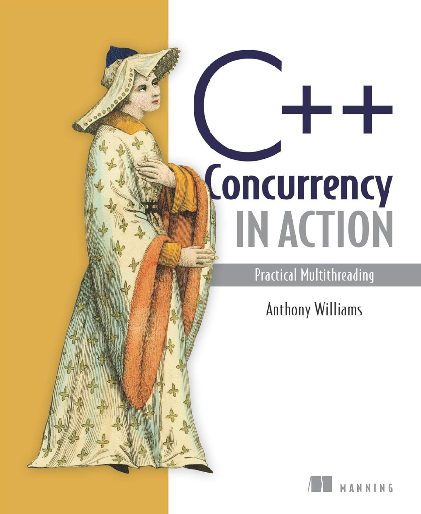
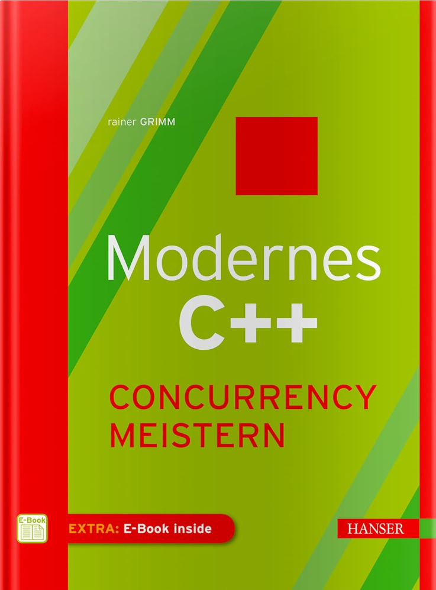
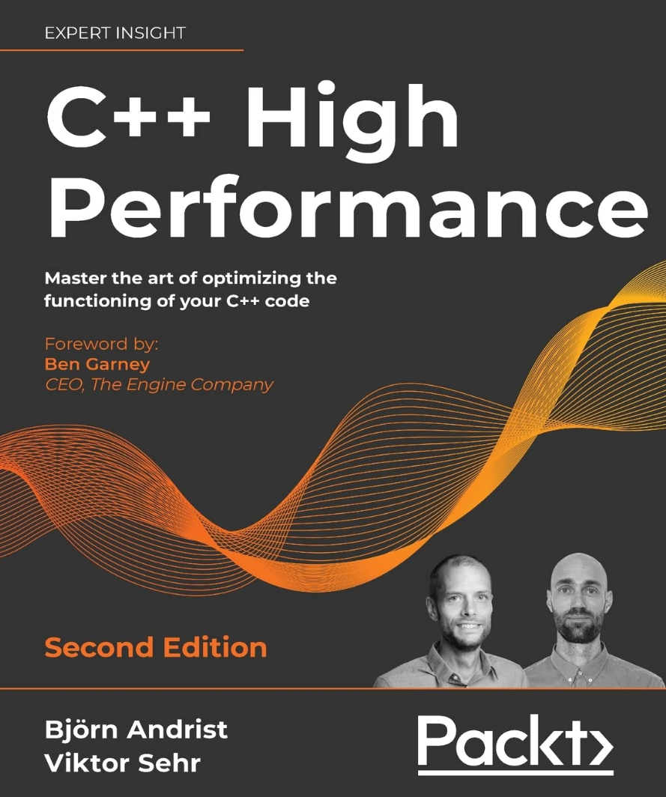
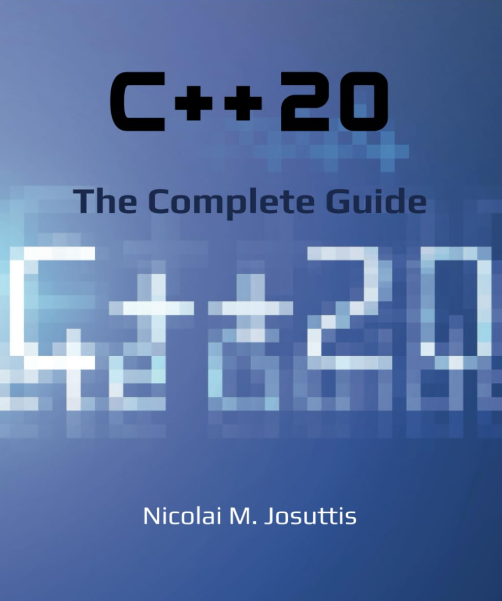

# Literatur

[Zurück](../Readme.md)

---

  * Williams, Anthony &bdquo;*C++ Concurrency in Action (2. Auflage)*&rdquo;. 
    Manning (10. Februar 2019), 592 Seiten. Sprache: Englisch. ISBN-13: 978-1617294693, ISBN-10: 1617294691.

    

   Siehe auch [hier](http://www.cplusplusconcurrencyinaction.com/).

---

  * Grimm, Rainer &bdquo;*Modernes C++ &ndash; Concurrency meistern*&rdquo;. 
    Carl Hanser Verlag GmbH & Co. KG (11. Juni 2018), 288 Seiten. Sprache: Deutsch. ISBN-13: 978-3446455900, ISBN-10: 3446455906.

    

---

  * Björn Andrist, Viktor Sehr &bdquo;*C++ High Performance (2. Auflage)*&rdquo;. 
    Packt Publishing (21. Dezember 2020), 544 Seiten. Sprache: Englisch. ISBN-13: 978-1839216541, ISBN-10: 1839216549.

    

---

  * Josuttis, Nicolai M., &bdquo;*C++20 - The Complete Guide*&rdquo;. 
    NicoJosuttis (7. November, 2022), 768 Seiten. Sprache: Englisch. ISBN-13: 978-3967309201, ISBN-10: 3967309207.

    

---

  * Marc Gregoire, &bdquo;*Professional C++ (6. Auflage)*&rdquo;. 
    Wiley John + Sons (13. Februar 2024), 1326 Seiten. Sprache: Englisch. ISBN-13: 978-1394193172, ISBN-10: 1394193173.

    

---

[Zurück](../Readme.md)

---
